# one-shot-man (`osm`)

[](https://github.com/joeycumines/one-shot-man/actions/workflows/ci.yml)
[](https://github.com/joeycumines/one-shot-man/blob/main/go.mod)
[](LICENSE)

Refine reproducible one-shot prompts from your terminal, then paste them into the LLM UI you already use.

<p align="center">
  
</p>

`osm` is an extensible scriptable local-first CLI (with optional TUI) for constructing single-shot prompts:
files + diffs + notes + templates → prompt → clipboard.

It does **not** call any model API. No keys, no "agent platform", no network required.

I use this tool almost every day (work + personal projects).
Manually assembling and especially tweaking context was tiresome, so I built `osm` to help.

## Demos

<details>
<summary><strong>📋 Super-Document Builder (Visual TUI)</strong></summary>

Build structured prompts interactively with the visual TUI. Navigate with keyboard, add documents, and copy the final prompt to clipboard.


</details>

<details>
<summary><strong>💻 Super-Document Builder (Shell Mode)</strong></summary>

Prefer a REPL? Use `--shell` for a command-line interface to the same document builder.


</details>

<details>
<summary><strong>🔄 Mode Interoperability</strong></summary>

Switch seamlessly between visual TUI and shell modes. Documents persist across mode switches.


</details>

<details>
<summary><strong>🔍 Code Review Workflow</strong></summary>

Assemble review context: files, git diffs, and focus notes. Generate a comprehensive review prompt.


</details>

<details>
<summary><strong>🎯 Prompt Flow (Two-Step Builder)</strong></summary>

Let the model help write your prompt. Define a goal → generate meta-prompt → refine with task → assemble final.


</details>

<details>
<summary><strong>📝 Goal-Based Workflows</strong></summary>

Curated prompt templates for common tasks. Extensible with custom goals discovered from your filesystem.


</details>

<details>
<summary><strong>☀️ Light Theme Variant</strong></summary>


</details>

> **Note:** GIFs are auto-generated and reproducible. To regenerate: `make generate-tapes-and-gifs` (requires [VHS](https://github.com/charmbracelet/vhs)).

## Features

How it works:

```mermaid
%%{init: {'theme': 'base', 'themeVariables': { 'fontFamily': 'Arial', 'fontSize': '14px', 'primaryColor': '#fff', 'edgeLabelBackground':'#fff'}}}%%
flowchart LR
    classDef userNode fill: #e3f2fd, stroke: #1565c0, stroke-width: 2px, color: #0d47a1, rx: 10, ry: 10;
    classDef osmNode fill: #f3e5f5, stroke: #7b1fa2, stroke-width: 2px, color: #4a148c, rx: 10, ry: 10;
    classDef llmNode fill: #e8f5e9, stroke: #2e7d32, stroke-width: 2px, color: #1b5e20, rx: 10, ry: 10;
    classDef subGraphStyle fill: #ffffff, stroke: #cfd8dc, stroke-width: 2px, rx: 10, ry: 10, stroke-dasharray: 5 5;
    subgraph You ["User Context"]
        direction TB
        edit["Edit code in repo"]:::userNode
        run["Run osm"]:::userNode
    end
    subgraph OSM ["OSM Tool"]
        direction TB
        gather["Gather context<br/>(files/diffs/notes)"]:::osmNode
        render["Render prompt<br/>(templates/goals)"]:::osmNode
        clip["Copy to clipboard"]:::osmNode
    end
    subgraph LLM ["LLM Interface"]
        direction TB
        paste["Paste prompt"]:::llmNode
        answer["Get output"]:::llmNode
    end
    class You subGraphStyle
    class OSM subGraphStyle
    class LLM subGraphStyle
    edit --> run
    run --> gather
    gather --> render
    render --> clip
    clip -.-o paste
    paste --> answer
    linkStyle default stroke: #546e7a, stroke-width: 2px, fill: none;
```



### The "Daily Drivers"

These are the builtin commands to generate prompts from your codebase.

- **`osm code-review`**: Interactive code review prompt builder. Assembles files, git diffs, and notes into a structured review request.
- **`osm prompt-flow`**: Two-step prompt builder. Use this when you want the model to help shape the final ask (Meta-Prompt → Final Prompt).
- **`osm goal` (e.g. `commit-message`)**: Curated prompt templates and workflows (built-ins + discovery of custom goals).

### Consensus & Assembly

**`osm super-document`**: **Visual & Shell Modes**

**Summary:** Assembles a single, internally consistent document from multiple sources.

**The Workflow:** Use the TUI as a "bin" to collect inputs—such as multiple AI responses from an `osm code-review` session or various text files. The tool merges these documents with your repository context (files/diffs) and renders a final prompt designed to force internal consistency and discard hallucinations.

**Modes:**

- **Visual TUI:** Paste/Add documents, review content, and copy the result.
- **Shell REPL (`--shell`):** More functionality, just not quite as convenient.

**Why use it:** To improve quality and reliability. By aggregating multiple AI outputs and forcing them through a consistency template, you produce a higher-fidelity result than any single shot could achieve.

### Session Persistence

State persists locally to your terminal session.

- **Persistence:** You can start a workflow (e.g., `osm code-review`), exit it, and resume later.
- **Shared Context:** State is shared across compatible commands. You can gather context in one command and refine it in another.
- **Mode Interoperability:** *Distinct from session persistence*, this feature allows you to switch between Visual TUI and Shell REPL modes *within the same process* (see Demos above) without losing transient state.

### For Hackers / Scripting

Command `osm` is a scripting engine.

- **Powered by Goja:** An embedded JavaScript runtime powers the core workflows.
- **Native Bindings:** Includes native bindings for **Go Prompt** (Shell TUI), **Bubble Tea** (Arbitrary TUI), **Lipgloss** (styling), and the system clipboard.
- **Customizable:** You can write your own interactive workflows in JavaScript that run natively in `osm`. The built-in commands (`code-review`, `goal`, etc) are actually scripts that you can inspect and modify.

Future functionality based on merits.
Fair warning: This may include experimental features which expand the scope of functionality.
See also [docs/todo.md](docs/todo.md).

## Quickstart

Install from source:

```sh
go install github.com/joeycumines/one-shot-man/cmd/osm@latest
```

Sanity check:

```sh
osm version
osm help
osm goal -l
osm session id
```

Run a tiny non-interactive script:

```sh
osm script -e 'output.print("hello from osm")'
# hello from osm
```

See what "context" means (this is what the interactive flows build on):

```sh
osm script -e 'context.addPath("go.mod"); output.print(JSON.stringify(context.getStats()))'
# {"totalPaths":1,"files":1,"directories":0,"totalSize":...}
```

Then try an interactive workflow:

```sh
osm code-review
```

Inside the TUI, the loop is typically:
`add` (files) → `diff` (git) → `note` (freeform) → `show`/`copy`.

## Workflows worth trying

```sh
osm code-review
```

Build a single prompt for "review this change", with concrete focus areas.
Tip: `note --goals` prints pre-written review-focus snippets you can add quickly.

```sh
osm prompt-flow
```

Use this when you want a model to *help you write the final prompt*.
The flow is explicit: define goal + context → generate meta prompt → paste a task prompt → assemble final.

```sh
osm goal -l
osm goal <goal-name>
```

Goals are interactive "recipes" (implemented declaratively) for common software-engineering tasks.
They are extensible, and discovered automatically from your filesystem.

## Good defaults (and sharp edges)

- Works best when leveraging powerful chat-based models billed on a subscription basis.
- Clipboard-first is deliberate: it works in locked-down environments and stays provider-agnostic.

**Sharp edges / caveats:**

- **Script autodiscovery:** Discovery of user scripts works, but the file system traversal rules and UX are currently experimental.
- **Logging surface (`log.*`):** While available for debugging custom scripts, the logging API is not yet stable.

## Stability

N.B. The `osm` tool includes a scripting environment as a core component.

- Prompts and commands are subject to change, but are likely to remain largely stable.
- No stable (v1) release; APIs are pre-v1 and may change. This `README.md` is the single source of truth for stability.
- There are areas of active development:
    - JS bindings for the [Charm](https://github.com/charmbracelet) ecosystem (see also [docs/scripting.md](docs/scripting.md)).

## Docs

- [docs/README.md](docs/README.md)
- [docs/shell-completion.md](docs/shell-completion.md)
- [docs/reference/command.md](docs/reference/command.md)
- [docs/reference/goal.md](docs/reference/goal.md)
- [docs/configuration.md](docs/configuration.md) (deep: [docs/reference/config.md](docs/reference/config.md))
- [docs/session.md](docs/session.md)
- [docs/scripting.md](docs/scripting.md)

## Visuals

- [docs/visuals/architecture.md](docs/visuals/architecture.md)
- [docs/visuals/workflows.md](docs/visuals/workflows.md)

## Development

```sh
make help # note: gmake on macOS (brew install make)
```

## License

See [LICENSE](LICENSE).
