# one-shot-man (`osm`)

[](https://github.com/joeycumines/one-shot-man/actions/workflows/ci.yml)
[](https://github.com/joeycumines/one-shot-man/blob/main/go.mod)
[](LICENSE)

Refine reproducible one-shot prompts from your terminal, then paste them into the LLM UI you already use.

`osm` is a local-first CLI (with optional TUI) for constructing single-shot prompts:
files + diffs + notes + templates → prompt → clipboard.

It does **not** call any model API. No keys, no "agent platform", no network required.

I use this tool almost every day (work + personal projects).
Manually assembling and especially tweaking context was tiresome, so I built `osm` to help.

## Features

How it works:

```mermaid
%%{init: {'theme': 'base', 'themeVariables': { 'fontFamily': 'Arial', 'fontSize': '14px', 'primaryColor': '#fff', 'edgeLabelBackground':'#fff'}}}%%
flowchart LR
    classDef userNode fill: #e3f2fd, stroke: #1565c0, stroke-width: 2px, color: #0d47a1, rx: 10, ry: 10;
    classDef osmNode fill: #f3e5f5, stroke: #7b1fa2, stroke-width: 2px, color: #4a148c, rx: 10, ry: 10;
    classDef llmNode fill: #e8f5e9, stroke: #2e7d32, stroke-width: 2px, color: #1b5e20, rx: 10, ry: 10;
    classDef subGraphStyle fill: #ffffff, stroke: #cfd8dc, stroke-width: 2px, rx: 10, ry: 10, stroke-dasharray: 5 5;
    subgraph You ["User Context"]
        direction TB
        edit["Edit code in repo"]:::userNode
        run["Run osm"]:::userNode
    end
    subgraph OSM ["OSM Tool"]
        direction TB
        gather["Gather context<br/>(files/diffs/notes)"]:::osmNode
        render["Render prompt<br/>(templates/goals)"]:::osmNode
        clip["Copy to clipboard"]:::osmNode
    end
    subgraph LLM ["LLM Interface"]
        direction TB
        paste["Paste prompt"]:::llmNode
        answer["Get output"]:::llmNode
    end
    class You subGraphStyle
    class OSM subGraphStyle
    class LLM subGraphStyle
    edit --> run
    run --> gather
    gather --> render
    render --> clip
    clip -.-o paste
    paste --> answer
    linkStyle default stroke: #546e7a, stroke-width: 2px, fill: none;
```



Core functionality:

- **`osm code-review`**: interactive code review prompt builder (files/diffs/notes → prompt → clipboard).
- **`osm prompt-flow`**: two-step prompt builder (meta-prompt → final prompt) when you want the model to help shape the final ask.
- **`osm goal`**: curated prompt templates/workflows (built-ins + discovery of custom goals).
- **`osm session`**: local persistence keyed to your terminal environment (maintain state across commands).
- **`osm script`**: embedded JS runtime (Goja). The built-in workflows are scripts, allowing you to inspect or extend them.

Future functionality based on merits.
Fair warning: This may include experimental features which expand the scope of functionality.
See also [docs/todo.md](docs/todo.md).

## Quickstart

Install from source:

```sh
go install github.com/joeycumines/one-shot-man/cmd/osm@latest
```

Sanity check:

```sh
osm version
osm help
osm goal -l
osm session id
```

Run a tiny non-interactive script:

```sh
osm script -e 'output.print("hello from osm")'
# hello from osm
```

See what "context" means (this is what the interactive flows build on):

```sh
osm script -e 'context.addPath("go.mod"); output.print(JSON.stringify(context.getStats()))'
# {"totalPaths":1,"files":1,"directories":0,"totalSize":...}
```

Then try an interactive workflow:

```sh
osm code-review
```

Inside the TUI, the loop is typically:
`add` (files) → `diff` (git) → `note` (freeform) → `show`/`copy`.

## Workflows worth trying

```sh
osm code-review
```

Build a single prompt for "review this change", with concrete focus areas.
Tip: `note --goals` prints pre-written review-focus snippets you can add quickly.

```sh
osm prompt-flow
```

Use this when you want a model to *help you write the final prompt*.
The flow is explicit: define goal + context → generate meta prompt → paste a task prompt → assemble final.

```sh
osm goal -l
osm goal <goal-name>
```

Goals are interactive "recipes" (implemented declaratively) for common software-engineering tasks.
They are extensible, and discovered automatically from your filesystem.

## Good defaults (and sharp edges)

- Works best when leveraging powerful chat-based models billed on a subscription basis.
- Clipboard-first is deliberate: it works in locked-down environments and stays provider-agnostic.

**Sharp edges / caveats:**

- **Script autodiscovery:** Discovery of user scripts works, but the file system traversal rules and UX are currently experimental.
- **Logging surface (`log.*`):** While available for debugging custom scripts, the logging API is not yet stable.
- **Pre-v1:** In the absence of a stable release, all API surfaces are subject to change, if deemed necessary.

## Docs

- [docs/README.md](docs/README.md)
- [docs/reference/command.md](docs/reference/command.md)
- [docs/reference/goal.md](docs/reference/goal.md)
- [docs/configuration.md](docs/configuration.md) (deep: [docs/reference/config.md](docs/reference/config.md))
- [docs/session.md](docs/session.md)
- [docs/scripting.md](docs/scripting.md)

## Visuals

- [docs/visuals/architecture.md](docs/visuals/architecture.md)
- [docs/visuals/workflows.md](docs/visuals/workflows.md)

## Development

```sh
make help
```

## License

See [LICENSE](LICENSE).
