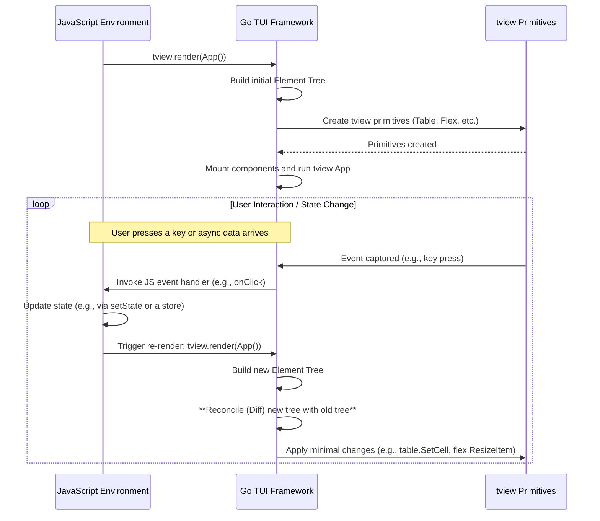
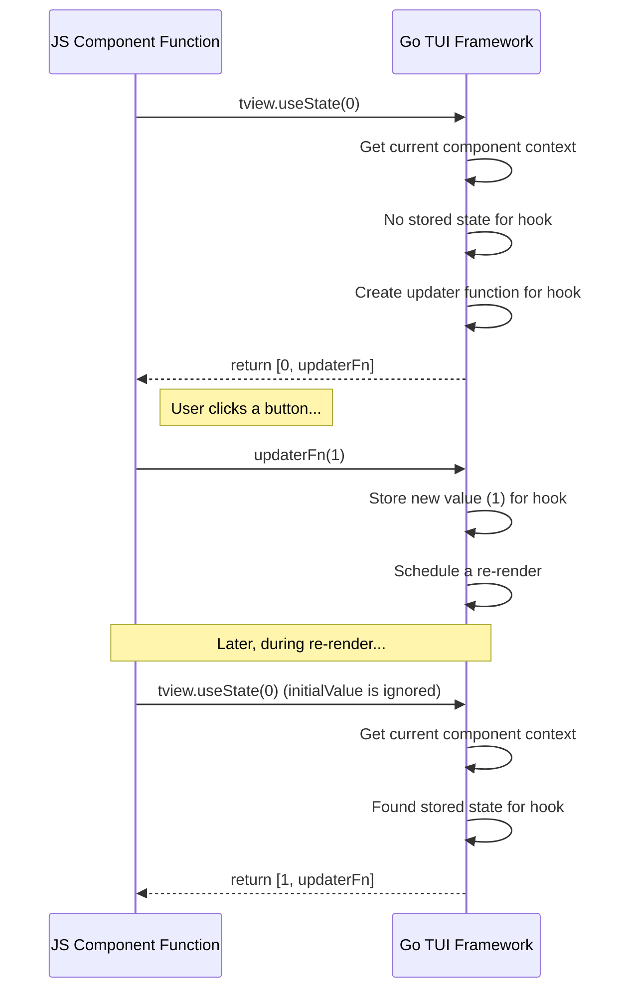

# React-like TUI Framework: Implementation Plan

This document outlines a comprehensive, multi-sprint implementation plan for building a composable, React-like Terminal User Interface (TUI) framework. The framework will be implemented in Go and controlled declaratively from JavaScript via the `goja` runtime, using `tview` as the underlying rendering engine.

-----

## Table of Contents

1.  [Core Architecture](#core-architecture)
2.  [Sprint 00: Foundation & First Vertical Slice (`view` command)](#sprint-00-foundation--first-vertical-slice-view-command)
3.  [Sprint 01: The Reconciliation Loop & State-Driven Updates](#sprint-01-the-reconciliation-loop--state-driven-updates)
4.  [Sprint 02: Event Handling & The Hook Primitive (`useState`)](#sprint-02-event-handling--the-hook-primitive-usestate)
5.  [Sprint 03: Layout Components & Composition](#sprint-03-layout-components--composition)
6.  [Sprint 04: Context API & Centralized State Pattern](#sprint-04-context-api--centralized-state-pattern)
7.  [Sprint 05: Custom JavaScript Components](#sprint-05-custom-javascript-components)

-----

## Core Architecture

The framework's architecture is designed to enable a declarative UI paradigm from JavaScript while leveraging the performance of Go and the robustness of `tview`.

### High-Level Data Flow

The core of the framework is a reconciliation loop that efficiently updates the UI based on changes in application state.



### Component Model

  - **Elements:** Plain JavaScript objects that describe what to render (e.g., `{ type: 'table', props: { ... } }`). They are immutable descriptions.
  - **Components (Go):** Go structs that manage the lifecycle of a `tview` primitive. They are responsible for creating, updating, and cleaning up their associated `tview` widget.
  - **Component Instances (Go):** Internal representations (a "virtual DOM") of the rendered component tree, holding the state and linking to the actual `tview` primitives.

-----

## Sprint 00: Foundation & First Vertical Slice (`view` command)

**Goal:** Establish the foundational Go/JS bridge and deliver the immediate short-term goal: a read-only, interactive TUI for the `view` command, replacing the PoC. This sprint strictly follows the "minimal vertical slice" principle.

#### **Tasks:**

1.  **Go: Core TUI Lifecycle (`osm:tview` module):**

      - Create the core `tview.Manager` in Go.
      - Expose a single blocking function to JS: `tview.render(element)`. This function will:
          - Take a JS object representing the root element.
          - Instantiate the corresponding Go component (`TableComponent`).
          - Create the underlying `tview` primitive.
          - Call `tview.Application.SetRoot()` and `Run()`.
      - The `render` function will block until the `tview` application is stopped.

2.  **Go/JS: Create `TableComponent`:**

      - Refactor the imperative logic from the `interactiveTable` PoC into a declarative, component-based structure.
      - The Go `TableComponent` will accept properties (`props`) from a JS element object for `title`, `headers`, and `rows`.
      - It will create and manage a `tview.Table` primitive.
      - It must support scrolling and exit on `q` or `ESC`, as per the PoC.

3.  **Go/JS: Callback Bridge for Events:**

      - Implement a mechanism to pass JS functions as callbacks.
      - The `TableComponent` will accept an `onSelect` prop (a JS function).
      - When a row is selected in `tview`, the Go component will invoke the stored `onSelect` JS callback with the `rowIndex`.
      - **Concurrency Note:** As per `update.md`, all callbacks in this sprint are synchronous and run on the main `tview` goroutine. No `QueueUpdateDraw` is needed yet.

4.  **JS: Implement the `view` Command:**

      - Rewrite the `view` command's JS handler.
      - It will gather the `contextItems` from the state.
      - It will construct a declarative `table` element object with the data and an `onSelect` handler.
      - It will call `tview.render(element)` to display the UI.
      - The `onSelect` handler will be empty for now (read-only view).

#### **Acceptance Criteria:**

  - [ ] A new Go module `osm:tview` is created and loadable from JS.
  - [ ] The REPL `view` command launches a full-screen, scrollable `tview` table populated with context items.
  - [ ] The TUI is defined declaratively in JS (e.g., `tview.render({ type: 'table', props: { ... } })`).
  - [ ] The TUI correctly exits upon pressing `q` or `ESC`.
  - [ ] The `interactiveTable` PoC code is fully replaced by the new component-based architecture.

-----

## Sprint 01: The Reconciliation Loop & State-Driven Updates

**Goal:** Introduce the core reconciliation ("diffing") algorithm. This transforms the framework from a one-shot renderer into a dynamic, state-driven system, laying the groundwork for all React-like patterns.

#### **Tasks:**

1.  **Go: Implement the Reconciler:**

      - Enhance the `tview.render(element)` function. It will now:
          - Maintain a reference to the current component instance tree (the "virtual DOM").
          - When called, it will diff the new element tree against the current instance tree.
          - The diffing logic will, for now, only handle prop changes on the root component. It will not handle adding/removing child components.
      - The `TableComponent` will gain an `Update` method called by the reconciler when its props change. This method will apply changes to the underlying `tview.Table` (e.g., update rows) without recreating it.

2.  **Go/JS: Introduce Asynchronicity and Concurrency Safety:**

      - Create a utility `tview.createTicker(interval, callback)` as described in `update.md`. This starts a new goroutine that invokes the JS `callback` periodically.
      - Implement the `SafeCallback` wrapper in the Go `Manager`. All callbacks passed from Go to JS that may be invoked from a different goroutine **must** be wrapped. This wrapper will use `app.QueueUpdateDraw` to ensure the JS code is executed on the main UI thread.

3.  **JS: Create a Stateful Ticker Example:**

      - Create a new example script that demonstrates a stateful component.
      - The script will render a `TextView` component (a new, simple component for this sprint).
      - It will use `tview.createTicker` to update a counter in its state every second.
      - On each tick, it will re-render the `TextView` with the new count. This proves the reconciliation loop works for state-driven updates.

    <!-- end list -->

    ```javascript
    // Conceptual Example
    let count = 0;
    const rootElement = () => ({
        type: 'textview',
        props: { text: `Counter: ${count}` }
    });

    // Initial render
    tview.render(rootElement());

    // Asynchronous state updates
    tview.createTicker(1000, () => {
        count++;
        // Re-render with new state
        tview.render(rootElement());
    });
    ```

#### **Acceptance Criteria:**

  - [ ] Calling `tview.render` multiple times updates the existing UI in place instead of recreating it.
  - [ ] A `TextView` component is available.
  - [ ] A ticker can be created in JS, and its callback, running on a background goroutine, can safely trigger UI updates on the main thread.
  - [ ] An example demonstrates a clock or counter updating live on screen, proving the end-to-end reconciliation flow.

-----

## Sprint 02: Event Handling & The Hook Primitive (`useState`)

**Goal:** Formalize event handling and introduce the first and most fundamental hook, `useState`. This provides the foundation for the **Hierarchical Hooks** state management pattern described in `state-concepts.md`.

#### **Tasks:**

1.  **Go: Formalize the Component Interface:**

      - Based on `TableComponent` and `TextViewComponent`, define a formal `Component` interface in Go (e.g., `Create`, `Update`, `Destroy`).
      - The reconciler will now work with this interface.

2.  **Go/JS: Generic Event Handling:**

      - Update the reconciler to handle generic `on<Event>` props.
      - For a `TableComponent`, an `onSelect` prop should be automatically wired. For a new `ButtonComponent`, `onClick` should be wired.
      - This allows JS to provide event handlers declaratively: `<Button onClick={() => ... } />`.

3.  **Go: Implement the Hook Processor:**

      - In the Go `Manager`, add state for managing the "currently rendering component".
      - Create a data structure to store hook data, indexed by component ID and hook index.
      - Expose a Go function `tview.useState(initialValue)` to JS.

4.  **JS: The `useState` Hook Implementation:**

      - When `tview.useState(initialValue)` is called from within a JS component function:
          - Go retrieves the state for the currently rendering component.
          - On the first render, it stores `initialValue` and returns `[initialValue, updaterFn]`.
          - On subsequent renders, it returns `[storedValue, updaterFn]`.
          - The `updaterFn` is a `SafeCallback` that, when called with a new value, updates the stored value in Go and triggers a global re-render.

#### **Diagram: `useState` Data Flow**



#### **Acceptance Criteria:**

  - [ ] A basic `ButtonComponent` is created.
  - [ ] A JS component can use `const [count, setCount] = tview.useState(0);` to manage its internal state.
  - [ ] Calling the `setCount` function correctly triggers a re-render of the component with the updated `count` value.
  - [ ] The **Hierarchical Hooks** state pattern is now viable for implementation in JavaScript.

-----

## Sprint 03: Layout Components & Composition

**Goal:** Enable the creation of complex UIs by introducing layout components (`Flex`) and full support for component children in the reconciler.

#### **Tasks:**

1.  **Go: Reconciler Child Support:**

      - Upgrade the reconciler to handle `children` arrays in element trees.
      - Implement the core logic for adding, removing, and reordering child components.
      - Use a simple key-based diffing algorithm (`id` prop) to efficiently manage child lists.

2.  **Go/JS: Create `FlexComponent`:**

      - Implement a `FlexComponent` that manages a `tview.Flex` primitive.
      - It will accept props to control `direction` (`row` or `column`).
      - The reconciler will add/remove children to the `tview.Flex` layout based on the element's `children` array.

3.  **JS: Build a Composite View:**

      - Rewrite the `view` command UI using the new layout components.
      - The new UI will be composed of:
          - A root `Flex` component (direction: column).
          - A `TextView` for the title.
          - The existing `TableComponent` to display the context items.
          - A `TextView` for the footer/status bar.
      - This task validates that composition works as expected.

#### **Acceptance Criteria:**

  - [ ] The reconciler can manage nested component trees.
  - [ ] A `<Flex>` component can arrange its children horizontally or vertically.
  - [ ] JS code can describe a nested UI tree, e.g., `<Flex><TextView/><Table/></Flex>`.
  - [ ] The `view` command's UI is now built using composition, proving the model's viability.

-----

## Sprint 04: Context API & Centralized State Pattern

**Goal:** Implement a `Context` API to allow for "prop drilling" avoidance and provide the final primitive needed to enable the **Centralized Store** state management pattern from `state-concepts.md`.

#### **Tasks:**

1.  **Go/JS: Implement `createContext`:**

      - Expose `tview.createContext(defaultValue)` to JS. This returns a `Provider` and `Consumer` component type (or equivalent hook).
      - The `Provider` component will store its `value` prop in a Go-side map, keyed by the context ID.
      - The reconciler will track the current context value as it traverses the tree.

2.  **Go/JS: Implement `useContext` Hook:**

      - Expose `tview.useContext(contextObject)` to JS.
      - When called, this hook will look up the component's ancestor tree in Go to find the nearest `Provider` for the given `contextObject` and return its value.
      - Crucially, Go will also record that this component instance is a subscriber to this context. When a `Provider`'s value changes, the reconciler will know to re-render all subscribing components.

3.  **JS: Build Centralized Store Example (`useReducer`):**

      - Create a pure-JS implementation of a `useReducer` hook using `useState`.
      - Create a JS example that implements the "Centralized Store" pattern:
          - A single `useReducer` at the top of the app manages all state.
          - The `state` and `dispatch` function are passed down via the new Context API.
          - Descendant components use `useContext` to access the state and dispatch actions.
          - This provides a working reference implementation and proves the underlying primitives are sufficient.

#### **Acceptance Criteria:**

  - [ ] A Context object with a `Provider` can be created and used in JS.
  - [ ] A `useContext` hook allows descendant components to read values from the context.
  - [ ] Changing the `value` of a `Provider` triggers a re-render in consuming components.
  - [ ] A complete example demonstrates the **Centralized Store** pattern managing the state of a multi-component application.

-----

## Sprint 05: Custom JavaScript Components

**Goal:** Empower users to create their own components entirely in JavaScript, loadable via `require`. This completes the core framework by making it fully extensible.

#### **Tasks:**

1.  **Go: Reconciler Support for Function Components:**

      - Update the reconciler to handle element types that are functions (`type: myFunction`).
      - When it encounters a function component, the reconciler must:
          - Call the function (this is the component's "render" method).
          - Set the internal "currently rendering component" context so that hooks like `useState` work correctly.
          - Take the returned element tree from the function and reconcile it.

2.  **JS: Define Component Convention:**

      - Document the convention: A JS component is a function that accepts `props` as its first argument and returns a renderable element (or `null`).
      - Update the `require` mechanism (if necessary) to handle loading these component files correctly.

3.  **JS: Refactor an Existing View into a Custom Component:**

      - Take the composite view built in Sprint 03 (title, table, footer) and refactor it into a reusable JS function component in its own file (`ContextViewer.js`).
      - The main `view` command handler will now simply `require('./ContextViewer.js')` and render it: `<ContextViewer items={...} />`.

#### **Acceptance Criteria:**

  - [ ] The framework can render components defined as JavaScript functions.
  - [ ] Hooks (`useState`, `useContext`) work correctly from within custom JS components.
  - [ ] A JS component can be defined in a separate `.js` file and loaded via `require()`.
  - [ ] The implementation of the `view` command is simplified by using a custom, reusable JS component.
  - [ ] Documentation is written for JS developers explaining how to create their own components.
