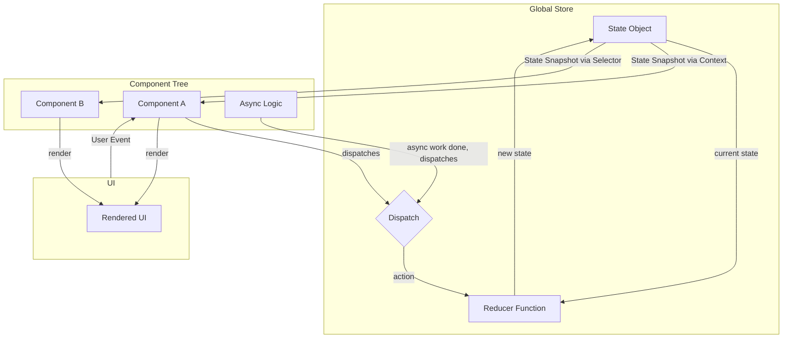
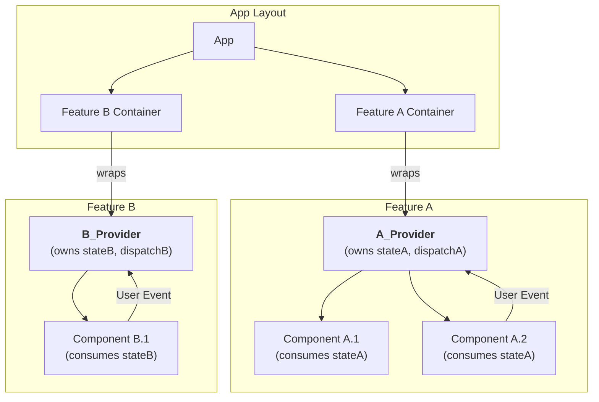

# TUI State Management Patterns

The following is an AI-generated analysis of potential state management patterns for a hook-based
UI framework (e.g., React), generated in the context of an example event-driven architecture.

-----

### **Foundational Principles Translation**

Before presenting the variants, let's establish the mapping from the Go implementation's concepts to a hook-based UI
paradigm (e.g., React):

| Go TUI                                  | Hook-Based UI (React)                                                                                                                                                       |
|:----------------------------------------|:----------------------------------------------------------------------------------------------------------------------------------------------------------------------------|
| Central `state` struct                  | A state object managed by `useReducer` or a similar hook.                                                                                                                   |
| `State()` method (immutable snapshot)   | The state value returned by a hook for a given render. Immutability is enforced by reducer logic (always returning new objects).                                            |
| Main Event Loop (`select` on channels)  | The React scheduler + a `dispatch` function from `useReducer`. All actions are funneled through the reducer, serializing state updates.                                     |
| `update` function ("Reducer")           | The **reducer function** passed to `useReducer`. It's a pure function: `(state, action) => newState`. It calculates the next state.                                         |
| `view` function ("Effector")            | The **React component function body**. It receives the new state and renders the UI. React handles the "commit" phase, applying the new state and triggering this function. |
| `externalLogicChan` (Command Pattern)   | The **`dispatch` function**. Asynchronous logic (e.g., data fetching) doesn't mutate state directly; it calls `dispatch` with an action object to request a state change.   |
| `stateVar` interface (Selector Pattern) | A **selector function**, often memoized with `useMemo` or a dedicated library, that extracts a specific slice of data from a larger state object.                           |

-----

### Variant 1: Centralized Store with Reducer and Selectors

This variant is the most direct translation of the Go architecture. It employs a single, application-wide state store,
provided to all components through context. It is ideal for applications with complex, overlapping, and highly
interconnected state.

#### **1. Architectural Diagram**



#### **2. Pattern Definition**

* **State Management (`useReducer` + `Context`):**
  A single `useReducer` hook manages the entire shared application state. The resulting `state` and `dispatch` function
  are placed into a React Context, making them available to any component in the tree without prop drilling.

    * **Component-Owned State:** Components remain free to use local state (`useState`) for UI-specific concerns (e.g.,
      form input state, toggle flags) that do not need to be shared globally. This directly fulfills the requirement for
      components to own internal state while consuming external state.

* **Immutable Snapshot (The `State()` analog):**
  Any component can access the global, read-only state snapshot by using a custom hook (e.g., `useStoreState()`) that
  internally calls `useContext`. Since the reducer must be a pure function that returns new state objects upon any
  change, the value received by the component for each render is guaranteed to be an immutable snapshot for that render
  cycle.

* **Requesting State Changes (The `externalLogicChan` analog):**
  Components request changes to the global state by calling the `dispatch` function, obtained via a `useStoreDispatch()`
  hook. This function takes a single argument: an `action` object (e.g.,
  `{ type: 'MOVE_ACTOR', payload: { id: 'actor1', x: 100, y: 50 } }`). This serializes all mutation requests, including
  those from asynchronous operations, which also receive the `dispatch` function to signal their completion or failure.

* **Unidirectional Data Flow:**
  The flow is strict and predictable, mirroring the `update`/`view` cycle.

    1. **Event:** A user interacts with the UI, or an async operation completes.
    2. **Dispatch:** The event handler calls `dispatch(action)`. This sends a command to the store.
    3. **Reducer (Calculation):** The reducer function receives the *current state* and the `action`. It computes the
       *next state* without any side effects and returns it. This is the pure "update" phase.
    4. **Commit & Re-render (Execution):** React detects the state change from the store's provider. It updates the
       context value and re-renders all components that consume this context (or whose selected data has changed). This
       is the "view" phase.

* **Selector Pattern (The `stateVar` analog):**
  To decouple components from the global state shape and optimize performance, we introduce a `useSelector` hook.

    * It takes a selector function as an argument: `(state) => derivedValue`.
    * It subscribes to the store but only triggers a re-render in the component if the *return value* of the selector
      function changes.
    * This is typically implemented with memoization (`useMemo`) to ensure that `derivedValue` is only recomputed when
      its dependencies in the state tree change.

#### **3. Conceptual Implementation**

```javascript
// store.js - The central store definition
import React, {createContext, useContext, useReducer, useMemo} from 'react';

const StoreContext = createContext(null);

const initialState = { /* ... initial global state ... */};

const reducer = (state, action) => {
    // Pure function to calculate next state
    switch (action.type) {
        case 'MOVE_ACTOR':
        // ... returns a NEW state object
        default:
            return state;
    }
};

export const StoreProvider = ({children}) => {
    const [state, dispatch] = useReducer(reducer, initialState);
    // Memoize the context value to prevent unnecessary re-renders of consumers
    // where dispatch is stable and state is handled by selectors.
    const value = useMemo(() => [state, dispatch], [state]);
    return <StoreContext.Provider value={value}>{children}</StoreContext.Provider>;
};

// Custom hooks to access state and dispatch
export const useStoreState = () => {
    const [state] = useContext(StoreContext);
    return state;
};

export const useStoreDispatch = () => {
    const [, dispatch] = useContext(StoreContext);
    return dispatch;
};

// The efficient selector hook
export const useSelector = (selectorFn) => {
    const [state] = useContext(StoreContext);
    // The selector function derives state. useMemo prevents re-calculation
    // unless the state object itself changes. More robust libraries would
    // compare selectorFn inputs.
    return useMemo(() => selectorFn(state), [state, selectorFn]);
};
```

#### **4. Trade-offs**

* **Developer Experience:** Good. Centralized logic is easy to reason about. Custom hooks (`useSelector`,
  `useStoreDispatch`) provide a clean API. Can lead to boilerplate for defining actions and reducer cases.
* **Performance:** High potential for optimization. The `useSelector` pattern is critical; without it, any global state
  change would re-render every connected component. With it, re-renders are surgical and efficient.
* **Testability:** Excellent. Reducers are pure functions and can be unit-tested in isolation by simply providing a
  state and an action and asserting the output.
* **Scalability:** Very high. This pattern is the foundation of libraries like Redux and Zustand, designed for
  large-scale applications with complex shared state.

-----

### Variant 2: Hierarchical State Hooks with Peer-to-Peer Communication

This variant diverges from a single central store, instead embracing composition. State is owned by a container
component at the lowest possible level in the tree and shared downwards with its children via Context. This is suitable
for applications where state can be cleanly partitioned into independent "features" or domains.

#### **1. Architectural Diagram**



#### **2. Pattern Definition**

* **State Management (`useReducer` per Feature):**
  Instead of one global store, each logical feature or "smart" container component creates its own state management with
  `useReducer`. It then wraps its children in a dedicated Context Provider for that feature. A component can consume
  state from an ancestor's context while also being a provider for its own descendants.

* **Immutable Snapshot (The `State()` analog):**
  This works identically to Variant 1, but is scoped. A component calls `useContext(FeatureAContext)` to get an
  immutable snapshot of *Feature A's* state. It is completely unaware of `FeatureBContext` unless it is also a
  descendant of it.

* **Requesting State Changes (The `externalLogicChan` analog):**
  Dispatch is also scoped. A component consuming `FeatureAContext` receives `dispatchA`. Calling this function sends an
  action only to the reducer managing Feature A's state. This localizes the impact of any command. Asynchronous logic
  must be initiated from a component within the context's scope to get access to the correct `dispatch` function.

* **Unidirectional Data Flow:**
  The flow remains unidirectional but is localized to a subtree.

    1. **Event:** A user interacts with a component inside Feature A.
    2. **Dispatch:** The component calls `dispatchA(action)`.
    3. **Reducer (Calculation):** The reducer for Feature A calculates `nextStateA`.
    4. **Commit & Re-render (Execution):** React updates the `FeatureAContext.Provider`, causing only components within
       that subtree that consume the context to re-render. Components in Feature B are unaffected.

* **Selector Pattern (The `stateVar` analog):**
  While less critical due to the smaller state objects, the pattern is still valuable. A component can consume the
  entire feature state via `useContext` and then use `useMemo` to compute a derived value. This prevents the component
  from re-rendering if a part of the feature's state that it *doesn't* care about changes.

#### **3. Conceptual Implementation**

```javascript
// features/actor/ActorContext.js - A self-contained state module
import React, {createContext, useContext, useReducer, useMemo} from 'react';

const ActorContext = createContext(null);

const initialState = {actors: {}, selectedActorId: null};

const actorReducer = (state, action) => { /* ... logic for actors ... */
};

// This is a composable provider component
export const ActorStateProvider = ({children}) => {
    const [state, dispatch] = useReducer(actorReducer, initialState);
    const value = useMemo(() => [state, dispatch], [state]);
    return <ActorContext.Provider value={value}>{children}</ActorContext.Provider>;
};

// Custom hooks scoped to this feature
export const useActorState = () => {
    const [state] = useContext(ActorContext);
    return state;
};

export const useActorDispatch = () => {
    const [, dispatch] = useContext(ActorContext);
    return dispatch;
};

// App.js - Composing the features
import {ActorStateProvider} from './features/actor/ActorContext';
import {InventoryStateProvider} from './features/inventory/InventoryContext';
import {ActorPanel} from './components/ActorPanel';
import {InventoryPanel} from './components/InventoryPanel';

const App = () => (
    <main>
        <ActorStateProvider>
            <ActorPanel/>
            {/* This and its children can access actor state */}
        </ActorStateProvider>
        <InventoryStateProvider>
            <InventoryPanel/>
            {/* This and its children can access inventory state */}
        </InventoryStateProvider>
    </main>
);
```

#### **4. Trade-offs**

* **Developer Experience:** Excellent for well-partitioned applications. State logic is co-located with the features
  that use it, making the codebase easier to navigate and reason about. Can lead to "provider hell" (deeply nested
  providers) if not managed well.
* **Performance:** Generally very good. State updates are naturally scoped, so the "blast radius" of a re-render is much
  smaller than in a naive centralized approach. This can sometimes be more performant by default than a centralized
  store that relies heavily on selector optimization.
* **Testability:** Good. Reducers are still pure functions and easy to test. Testing components may require wrapping
  them in the appropriate mock Provider.
* **Scalability:** Scales well horizontally (by adding more features). Can become complex when state needs to be shared
  *between* features. This often requires "lifting state up" to a common ancestor provider, which can push the
  architecture back towards Variant 1 for that piece of shared state.
