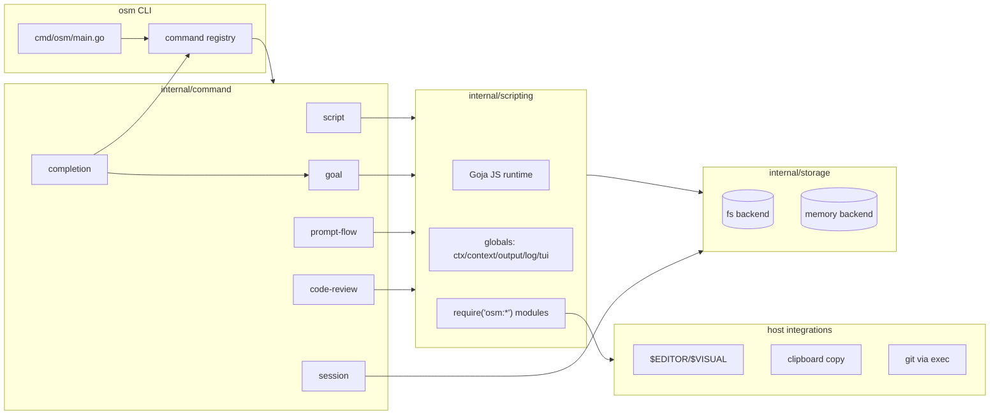

# Architecture diagram (placeholder)

**Caption:** High-level data/control flow for `osm`.

**Recommended render:** `docs/visuals/assets/architecture.png`

**Alt text:** Diagram showing `osm` CLI commands calling Go command implementations, some of which invoke an embedded JavaScript engine; sessions and local storage persist state; clipboard/editor integration sit alongside.

