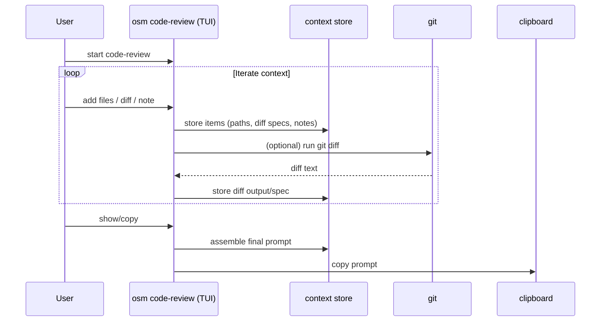
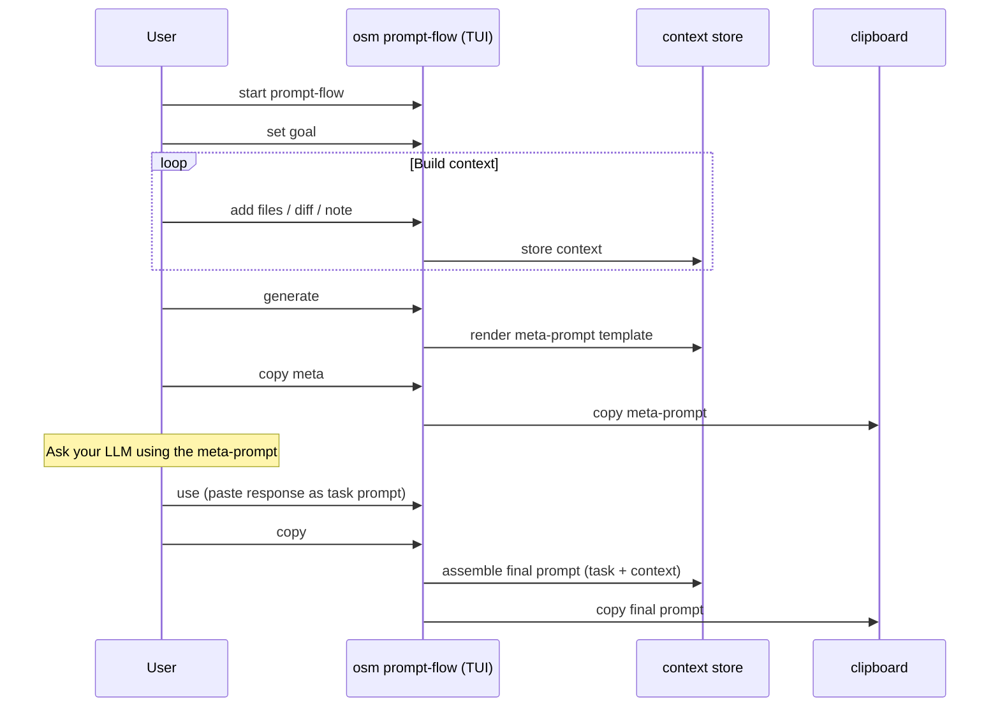

# Workflows (placeholders)

## Code review workflow

**Caption:** Build a single, context-rich prompt for a code review.

**Recommended render:** `docs/visuals/assets/workflow-code-review.png`

**Alt text:** Sequence diagram showing user iteratively adding files/diffs/notes in a TUI, then generating a prompt and copying it to clipboard.

## Prompt-flow workflow

**Caption:** Two-phase prompting: meta-prompt first, then final task prompt.

**Recommended render:** `docs/visuals/assets/workflow-prompt-flow.png`

**Alt text:** Sequence diagram showing goal and context feeding meta-prompt generation, then user pasting an LLM response as the task prompt and assembling final output.

