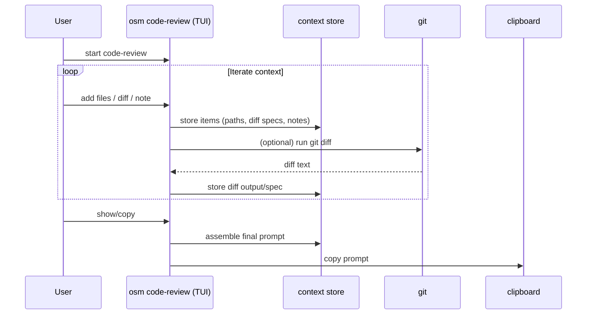
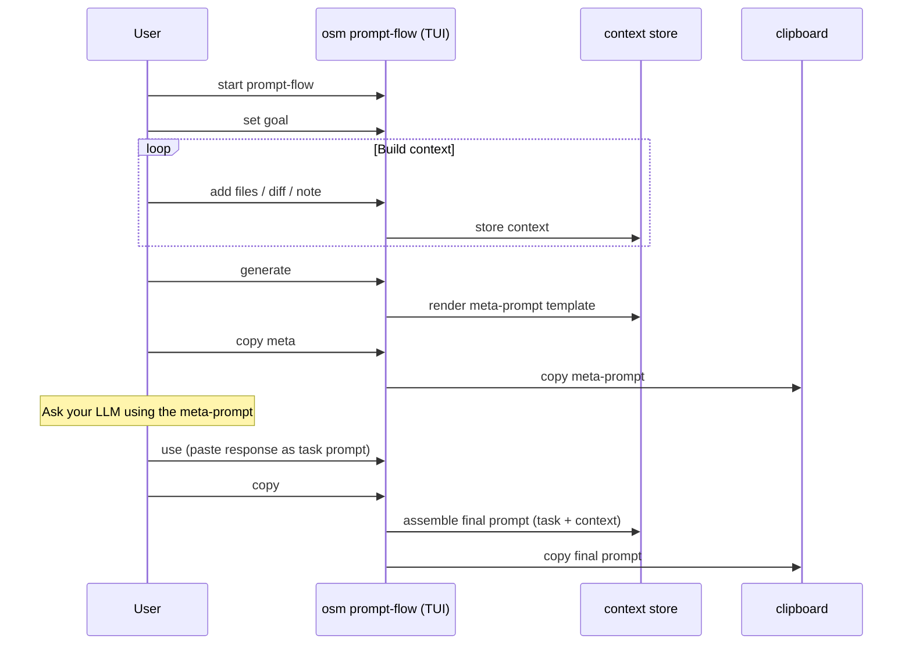

# Workflows

This document describes the core workflows provided by osm with visual diagrams and recordings.

## Recorded Demos

Interactive GIF recordings of each workflow are available in [`docs/visuals/gifs/`](gifs/):

| Workflow                 | Recording                                                                         | Description                              |
|--------------------------|-----------------------------------------------------------------------------------|------------------------------------------|
| Quickstart               |             | Quick overview of osm commands           |
| Super-Document (Visual)  |  | Visual TUI document builder              |
| Super-Document (Shell)   |   | Shell/REPL document builder              |
| Super-Document (Interop) |  | Switching between visual and shell modes |
| Code Review              |             | Code review prompt builder               |
| Prompt Flow              |            | Two-step prompt builder                  |
| Goal                     |                   | Goal-based workflows                     |

> **Regenerating Demos:** Run `make generate-tapes-and-gifs` (requires [VHS](https://github.com/charmbracelet/vhs)).

## Code review workflow

**Caption:** Build a single, context-rich prompt for a code review.

**Recommended render:** `docs/visuals/assets/workflow-code-review.png`

**Alt text:** Sequence diagram showing user iteratively adding files/diffs/notes in a TUI, then generating a prompt and copying it to clipboard.

## Prompt-flow workflow

**Caption:** Two-phase prompting: meta-prompt first, then final task prompt.

**Recommended render:** `docs/visuals/assets/workflow-prompt-flow.png`

**Alt text:** Sequence diagram showing goal and context feeding meta-prompt generation, then user pasting an LLM response as the task prompt and assembling final output.

