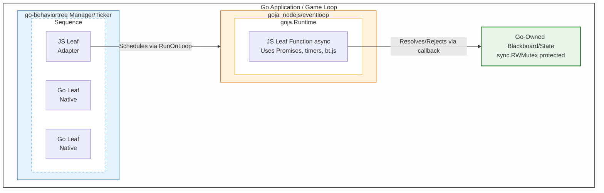

# Unified Architecture Specification: Integrating `bt.js` and `go-behaviortree` via Goja

**Status:** Canonical Reference Document  
**Scope:** Complete architectural analysis and implementation specification for bridging asynchronous JavaScript Behavior Trees (`bt.js`) with synchronous Go Behavior Trees (`go-behaviortree`) using the `goja` runtime.

---

## Table of Contents

1. [Executive Summary](#1-executive-summary)
2. [Core Technical Analysis](#2-core-technical-analysis)
3. [Major Design Axes](#3-major-design-axes)
4. [Architecture Variants](#4-architecture-variants)
5. [Recommended Architecture: Go-Centric with JS Leaves](#5-recommended-architecture-go-centric-with-js-leaves)
6. [Implementation Specification](#6-implementation-specification)
7. [State Management Patterns](#7-state-management-patterns)
8. [Concurrency and Runtime Topology](#8-concurrency-and-runtime-topology)
9. [Robustness, Error Handling, and Best Practices](#9-robustness-error-handling-and-best-practices)
10. [Performance Analysis](#10-performance-analysis)
11. [Decision Matrices](#11-decision-matrices)
12. [Optional Extensions](#12-optional-extensions)
13. [Migration Paths and Implementation Roadmap](#13-migration-paths-and-implementation-roadmap)

---

## 1. Executive Summary

### 1.1 The Core Engineering Challenge: Async/Sync Impedance Mismatch

There is **no single perfect solution** that offers 100% API compatibility, 100% Go library usage, and zero performance overhead simultaneously. The integration is fundamentally defined by an execution model mismatch:

| Aspect                       | `bt.js` (JavaScript)                      | `go-behaviortree` (Go)                  |
|------------------------------|-------------------------------------------|-----------------------------------------|
| **Tick Signature**           | `(children: Node[]) => Promise<Status>`   | `func(children []Node) (Status, error)` |
| **Return Semantics**         | Promise representing future completion    | Immediate status value                  |
| **`Running` Representation** | Pending Promise / re-execution via loop   | Returned value meaning "call me again"  |
| **Concurrency**              | Event Loop / Microtasks (single-threaded) | Goroutines / Mutexes (concurrent)       |

**Critical Implication:** A Go `Running` status does not naturally map to a pending JS Promise. In Go, it is a returned value; in JS, "running" is implied by the Promise not yet resolving. Direct wrapping without an architectural bridge is semantically impossible.

### 1.2 Non-Negotiable Requirements

1. **Event Loop is Mandatory:** Any viable solution **MUST** use `goja_nodejs/eventloop` or an equivalent custom implementation. JavaScript Promises require a microtask queue to resolve. Without an event loop, Promises created in `goja` will never resolve, and execution will hang indefinitely.

2. **Runtime Thread Safety:** `goja.Runtime` is **NOT** goroutine-safe. All interactions with the VM must occur on the event loop goroutine via `loop.RunOnLoop()`.

3. **Promise Resolution Location:** The `resolve` and `reject` functions returned by `vm.NewPromise()` **MUST** be called on the event loop goroutine.

### 1.3 The Recommended Solution

**Architecture:** Go-centric Behavior Trees using `go-behaviortree` as the canonical engine, with JS used exclusively for leaf behaviors through a carefully designed async bridge running on `goja_nodejs/eventloop`, and a Go-owned blackboard/state exposed to JS.

This design:

- Respects `goja`'s execution model and `eventloop` semantics
- Makes all BT scheduling and concurrency visible and testable in Go
- Allows JS to implement rich async behaviors using Promises and `bt.js`-style helpers inside leaves
- Leaves room to evolve toward deeper `bt.js` compatibility without compromising robustness

---

## 2. Core Technical Analysis

### 2.1 `go-behaviortree` Primitives

Key types and semantics:

```go
package behaviortree

type Node func() (Tick, []Node)
type Tick func(children []Node) (Status, error)
type Status int // Running, Success, Failure
```

Critical characteristics:

- `Status` is one of `Running`, `Success`, `Failure`
- Composites and wrappers are **synchronous functions**: `Sequence`, `Selector`, `Switch`, `Any`, `Memorize`, `Async`, `Background`, `Fork`, etc.
- Async behavior is encoded via ticks that **return `Running`** while work is ongoing elsewhere (typically a goroutine)
- `Async` and `Background` wrappers provide concurrency primitives
- Basic context-cancellation helpers (`Context` type) and ticker/manager constructs (`NewTicker`, `Manager`) are available

**Implication:** The BT engine itself is synchronous; asynchrony is modeled as "call returns `Running` and I'll complete later." Every Tick is a synchronous Go call.

### 2.2 `bt.js` Semantics

```typescript
type Status = 'running' | 'success' | 'failure';
type Node = () => [Tick, Node[]];
type Tick = (children: Node[]) => Promise<Status>;
```

Key characteristics:

- Composites `sequence`, `fallback`, `parallel`, `memorize`, `async`, `not`, `fork`, `interval` are all implemented in JS
- `run(node, ticker, abort)` drives a root node with an async iterator "ticker"
- Everything is promise-based and async/await-friendly

### 2.3 `goja` and `goja_nodejs/eventloop` Constraints

**Core constraints:**

1. **Runtime Thread Safety:** A `goja.Runtime` is **not goroutine-safe**. All interaction must be from **one goroutine at a time**.

2. **Promise Integration:** `Runtime.NewPromise()` + event loop pattern requires resolving/rejecting on the runtime goroutine (via `eventloop.RunOnLoop`).

3. **EventLoop APIs:**
    - `Run`: Block and execute until no pending jobs
    - `Start`/`Stop`: Background goroutine management
    - `RunOnLoop`: Schedule work on the event loop goroutine
    - `SetTimeout`/`SetInterval`: Timer primitives
    - `Terminate`: Forceful shutdown

4. **Module System:** `require.Registry` integrates Node-like `require()` with module resolution and caching.

**Implication:** For reliable async JS, you need **one goroutine that owns the VM and runs an event loop**, and all Go orchestration communicates via `RunOnLoop`.

### 2.4 The "Running" Semantic Equivalence

Despite syntactic differences, semantic parity exists:

| Go Behavior          | JS Behavior                                | Mapping         |
|----------------------|--------------------------------------------|-----------------|
| Returns `bt.Success` | Promise resolves to `"success"`            | Direct          |
| Returns `bt.Failure` | Promise resolves to `"failure"` or rejects | Direct          |
| Returns `bt.Running` | Promise in Pending state                   | Requires bridge |

The bridge must translate:

- **Pending JS Promise** → **`bt.Running`** return value in Go
- **Resolved JS Promise** → **`bt.Success` / `bt.Failure`** return value in Go

---

## 3. Major Design Axes

### 3.1 Where the BT Logic Lives

**Option 1: JS-Centric**

- JS owns the BT graph and composites using `bt.js`
- Go embeds the JS runtime and treats the whole JS tree as a leaf node

**Option 2: Go-Centric (Recommended)**

- `go-behaviortree` is canonical for tree structure and composites
- JS is used for **leaf actions/conditions only**
- Satisfies interoperability with Go BT module most naturally

**Option 3: Hybrid/Transpiled**

- BT authored in JS using `bt.js` style
- Compiled or translated into a Go `behaviortree.Node` graph at initialization
- JS tick functions may still be used as leaves

### 3.2 JS Runtime Topology

**Single Runtime + Event Loop:**

- One `EventLoop` + `Runtime` for the entire process
- All BT/JS work scheduled onto it
- Simple concurrency story; built-in Promise, timer, `require()` support

**Per-Actor Runtime:**

- Each logical entity has its own runtime + loop
- More isolation, but more overhead (~1-2MB per runtime)
- Complete failure domain isolation

**Runtime Pool:**

- A pool of runtimes with scheduling/actor model
- Complex due to non-shareable `goja` values across runtimes
- Requires binding agents to specific runtimes for their lifetime

### 3.3 State/Blackboard Location

**State in Go (Recommended):**

- Go blackboard/world state object with your own API
- JS sees it via `DynamicObject`, `SharedDynamicObject`, or plain wrapped structs
- Thread-safe, type-safe in Go, visible to other Go services

**State in JS:**

- JS objects represent main state; Go interacts by exporting/importing
- Harder to integrate with `go-behaviortree` and `go-pabt`
- More fragile regarding concurrency and GC

**Mirrored/Copy-on-Write:**

- "View" objects in JS reflecting Go state
- Updates marshalled back via explicit API

### 3.4 Event Loop Requirement

**Use `goja_nodejs/eventloop` (Required):**

- Mature, correct, handles promises, timers, `require()`
- Node-ish semantics sufficient for BT and async ticks

**Custom goja loop:**

- Own goroutine + job queue, manual pump of microtasks
- Re-implements much of `eventloop`; easy to get subtly wrong

**No loop (pure sync JS):**

- Only works if all JS ticks are synchronous and never return Promises
- Conflicts with `bt.js` pattern which is async by design
- **Not viable for this integration**

---

## 4. Architecture Variants

### 4.1 Variant A: Pure JavaScript (JS-Centric BT)

**Concept:** Author BTs in JS using exactly the `bt.js` API. Run them on a `goja` runtime + `eventloop`. From Go's perspective, a JS BT is encapsulated as one `behaviortree.Node` which drives the JS BT until terminal status or `Running`.

**Implementation Pattern:**

- JS side: Provide `bt.js` as a module, user builds tree using standard API
- Go side: Single `JSSubtree` node that schedules JS calls via `loop.RunOnLoop`

**Evaluation:**
| Aspect | Assessment |
|--------|------------|
| `bt.js` API Fidelity | 100% - Maximum reuse of existing JS logic |
| Go BT Integration | Shallow - Whole JS tree is black box |
| Complexity | Medium - Double scheduler (JS BT + Go BT) |
| Performance | Limited to JS execution speed |
| Use Case | JavaScript-centric teams, prototyping, legacy JS trees |

**Verdict:** Gives JS compatibility but does not truly integrate with `go-behaviortree` beyond "JS subtree as leaf node."

### 4.2 Variant B: Thin Wrapper

**Concept:** Wrap synchronous Go ticks directly as immediate JS Promises.

**Failure Analysis:** Go returns `Running` immediately. If mapped to a resolved Promise of `"running"`, `bt.js` logic breaks—it expects the Promise to *wait*, not resolve immediately with a "running" string. This destroys the async semantics of `bt.js` and requires the JS side to implement complex polling loops.

**Verdict:** **DO NOT USE.** Fails to bridge the semantic gap.

### 4.3 Variant C: Go-Centric with JS Leaves (Recommended)

**Concept:** Treat `go-behaviortree` as the canonical BT engine. All composite behavior (`Sequence`, `Selector`, `Switch`, `Memorize`, `Async`, `Fork`, `Background`, `RateLimit`, etc.) is in Go. JS is used for leaf actions and conditions only—their async nature is hidden behind a Go Tick wrapper.

**Evaluation:**
| Aspect | Assessment |
|--------|------------|
| Go BT Integration | Full - All composites and features available |
| Performance | Optimal - Tree traversal in compiled Go |
| Complexity | Medium - Requires async bridge implementation |
| State Management | Clean - State lives in Go, exposed to JS |
| Use Case | Production systems, existing Go BT codebases |

**Verdict:** Most effective, performant, and robust baseline solution.

### 4.4 Variant C.1: Polling-Based Bridge

**Mechanism:**

1. JS calls Go `Tick()` synchronously
2. If Go returns `Running`, JS schedules a retry via `setTimeout`/`setImmediate`
3. If Go returns `Success`/`Failure`, JS resolves the Promise

**Trade-offs:**

- Simpler implementation
- Polling introduces latency (1-10ms typical)
- Wasted CPU cycles during polling

### 4.5 Variant C.2: Event-Driven Bridge (Recommended for Production)

**Mechanism:**

1. JS calls wrapper; Go spawns goroutine
2. Goroutine manages synchronous Go Tick loop
3. Upon completion, goroutine signals Event Loop via `RunOnLoop` to resolve Promise

**Trade-offs:**

- Optimal performance (no polling overhead)
- Low latency
- Higher complexity (goroutine lifecycle management)
- ~1 goroutine per active async node

### 4.6 Variant D: Hybrid Compilation

**Concept:** JS authors write BTs in `bt.js` style. At initialization, the system inspects the JS tree and builds an equivalent Go `Node` graph. Runtime execution uses only the Go BT engine.

**Implementation Approach:**

- JS defines tree structure with metadata markers
- Go parses exported tree, maps composites to Go equivalents
- Leaves are wrapped as JS leaf ticks

**Evaluation:**
| Aspect | Assessment |
|--------|------------|
| Authoring Experience | `bt.js` style in JS |
| Runtime Performance | Pure Go BT engine |
| Complexity | High - Requires introspection and matching |
| Flexibility | Limited to mapped constructs |

**Verdict:** Use this approach when you require authoring in JS with a Go runtime; it is supported but incurs higher implementation cost and will require extra implementation effort to reach production robustness. This is explicitly in scope.

---

## 5. Recommended Architecture: Go-Centric with JS Leaves

### 5.1 High-Level Architecture



### 5.2 Component Responsibilities

**Go Side:**

- Maintains world/agent state (blackboard)
- Builds behavior trees using `go-behaviortree`
- Optionally uses `go-pabt` to construct planner BTs
- Runs `Tick()` loops via `NewTicker`/`Manager` or custom scheduler
- For certain leaves, executes JS functions on `eventloop` and maps results

**JS Side (running in `goja` with `eventloop`):**

- Implements leaf behaviors: `async function actFoo(ctx, args) { ... }`
- Uses Promises / async/await, timers, etc.
- Optionally uses `bt.js` helpers for sub-logic inside a leaf (but not for outer composite tree)

### 5.3 Data Flow for JS Leaf Tick

1. **Go Ticker** calls root node's `Tick()`
2. **Go composites** (Sequence, Selector) execute natively (zero JS overhead)
3. **JS Leaf Adapter** is reached:
    - **State: Idle** → Dispatch JS call to Event Loop, return `Running`
    - **State: Pending** → Check if Promise resolved, return `Running` if still pending
    - **State: Completed** → Return mapped status, reset state
4. **Event Loop** executes JS function, resolves Promise
5. **Callback** signals completion back to adapter state

---

## 6. Implementation Specification

This section is a prescriptive implementation specification: the code samples, APIs, and steps below are the canonical, actionable implementation and are intended to be followed as the definitive implementation when integrating `bt.js` with `go-behaviortree`.

### 6.1 Event Loop Setup

```go
package btbridge

import (
	"github.com/dop251/goja"
	"github.com/dop251/goja_nodejs/eventloop"
	"github.com/dop251/goja_nodejs/require"
)

// Bridge encapsulates the goja runtime and event loop
type Bridge struct {
	loop *eventloop.EventLoop
	vm   *goja.Runtime // Only access within RunOnLoop
}

// NewBridge creates and initializes the JS environment
func NewBridge() (*Bridge, error) {
	reg := require.NewRegistry(
		// Configure loaders and resolvers as needed
	)

	loop := eventloop.NewEventLoop(
		eventloop.WithRegistry(reg),
		eventloop.EnableConsole(true),
	)

	b := &Bridge{
		loop: loop,
	}

	// Start the event loop background goroutine
	loop.Start()

	// Initialize the JS environment
	errCh := make(chan error, 1)
	loop.RunOnLoop(func(vm *goja.Runtime) {
		b.vm = vm
		errCh <- b.initializeJS(vm)
	})

	if err := <-errCh; err != nil {
		loop.Stop()
		return nil, err
	}

	return b, nil
}

// initializeJS sets up the JS environment with helpers and API
func (b *Bridge) initializeJS(vm *goja.Runtime) error {
	// Install the runLeaf helper for Promise bridging
	_, err := vm.RunString(`
        globalThis.runLeaf = function(fn, ctx, args, callback) {
            Promise.resolve()
                .then(() => fn(ctx, args))
                .then(
                    (status) => callback(String(status), null),
                    (err) => callback("failure", err instanceof Error ? err.message : String(err))
                );
        };

        // Status constants for JS leaves
        globalThis.bt = {
            running: "running",
            success: "success", 
            failure: "failure"
        };
    `)
	return err
}

// Stop cleanly shuts down the event loop
func (b *Bridge) Stop() {
	b.loop.Stop()
}

// RunOnLoop schedules work on the event loop goroutine
func (b *Bridge) RunOnLoop(fn func(*goja.Runtime)) bool {
	return b.loop.RunOnLoop(fn)
}
```

### 6.2 State/Blackboard Implementation

```go
package btbridge

import (
	"sync"

	"github.com/dop251/goja"
)

// Blackboard is a thread-safe key-value store shared between Go and JS
type Blackboard struct {
	mu   sync.RWMutex
	data map[string]interface{}
}

// NewBlackboard creates an empty blackboard
func NewBlackboard() *Blackboard {
	return &Blackboard{
		data: make(map[string]interface{}),
	}
}

// Get retrieves a value (exposed to JS)
func (b *Blackboard) Get(key string) interface{} {
	b.mu.RLock()
	defer b.mu.RUnlock()
	return b.data[key]
}

// Set stores a value (exposed to JS)
func (b *Blackboard) Set(key string, value interface{}) {
	b.mu.Lock()
	defer b.mu.Unlock()
	b.data[key] = value
}

// Has checks if a key exists
func (b *Blackboard) Has(key string) bool {
	b.mu.RLock()
	defer b.mu.RUnlock()
	_, ok := b.data[key]
	return ok
}

// Delete removes a key
func (b *Blackboard) Delete(key string) {
	b.mu.Lock()
	defer b.mu.Unlock()
	delete(b.data, key)
}

// ExposeToJS registers the blackboard in the JS runtime
func (b *Blackboard) ExposeToJS(vm *goja.Runtime, name string) {
	vm.Set(name, map[string]interface{}{
		"get":    b.Get,
		"set":    b.Set,
		"has":    b.Has,
		"delete": b.Delete,
	})
}
```

### 6.3 JS Leaf Adapter: State Machine Implementation

This is the critical artifact handling the impedance mismatch. The adapter uses a mutex-protected state machine with non-blocking dispatch.

```go
package btbridge

import (
	"context"
	"errors"
	"fmt"
	"sync"

	"github.com/dop251/goja"
	bt "github.com/joeycumines/go-behaviortree"
)

// AsyncState tracks the lifecycle of a JS Promise within a Go Tick
type AsyncState int

const (
	StateIdle AsyncState = iota
	StateRunning
	StateCompleted
)

// JSLeafAdapter wraps a JS function to behave like a bt.Node
type JSLeafAdapter struct {
	// Static Configuration
	bridge *Bridge
	fnName string
	getCtx func() interface{} // Returns context/blackboard to pass to JS

	// Runtime State (Protected by Mutex)
	mu         sync.Mutex
	state      AsyncState
	lastStatus bt.Status
	lastError  error

	// Cancellation
	ctx    context.Context
	cancel context.CancelFunc
}

// NewJSLeafAdapter creates a bt.Node wrapping a JS function
func NewJSLeafAdapter(bridge *Bridge, fnName string, getCtx func() interface{}) bt.Node {
	ctx, cancel := context.WithCancel(context.Background())
	adapter := &JSLeafAdapter{
		bridge: bridge,
		fnName: fnName,
		getCtx: getCtx,
		state:  StateIdle,
		ctx:    ctx,
		cancel: cancel,
	}

	// Return the Node factory closure
	return func() (bt.Tick, []bt.Node) {
		return adapter.Tick, nil
	}
}

// Cancel stops any pending JS execution
func (a *JSLeafAdapter) Cancel() {
	a.cancel()
}

// Tick implements the non-blocking polling logic
func (a *JSLeafAdapter) Tick(children []bt.Node) (bt.Status, error) {
	a.mu.Lock()
	currentState := a.state
	a.mu.Unlock()

	switch currentState {
	case StateIdle:
		// Check for cancellation before dispatching
		select {
		case <-a.ctx.Done():
			return bt.Failure, errors.New("execution cancelled")
		default:
		}

		// Dispatch execution to the Event Loop
		a.dispatchJS()
		return bt.Running, nil

	case StateRunning:
		// Check for cancellation while running
		select {
		case <-a.ctx.Done():
			a.mu.Lock()
			a.state = StateIdle
			a.mu.Unlock()
			return bt.Failure, errors.New("execution cancelled")
		default:
		}
		// Still waiting for Promise resolution
		return bt.Running, nil

	case StateCompleted:
		a.mu.Lock()
		defer a.mu.Unlock()

		// Capture result
		status, err := a.lastStatus, a.lastError

		// Reset state for next execution cycle
		a.state = StateIdle
		a.lastStatus = 0
		a.lastError = nil

		return status, err
	}

	return bt.Failure, errors.New("invalid async state")
}

// dispatchJS schedules the JS execution on the Event Loop
func (a *JSLeafAdapter) dispatchJS() {
	a.mu.Lock()
	a.state = StateRunning
	a.mu.Unlock()

	ok := a.bridge.RunOnLoop(func(vm *goja.Runtime) {
		// Panic recovery
		defer func() {
			if r := recover(); r != nil {
				a.finalize(bt.Failure, fmt.Errorf("panic in JS leaf %s: %v", a.fnName, r))
			}
		}()

		// Look up the JS function
		fnVal := vm.Get(a.fnName)
		leafFn, ok := goja.AssertFunction(fnVal)
		if !ok {
			a.finalize(bt.Failure, fmt.Errorf("JS function '%s' not callable", a.fnName))
			return
		}

		// Look up the runLeaf helper
		runLeafVal := vm.Get("runLeaf")
		runLeafFn, ok := goja.AssertFunction(runLeafVal)
		if !ok {
			a.finalize(bt.Failure, errors.New("runLeaf helper not found"))
			return
		}

		// Create the Go callback that will be called from JS
		callback := func(call goja.FunctionCall) goja.Value {
			statusStr := call.Argument(0).String()
			var err error
			if !goja.IsNull(call.Argument(1)) && !goja.IsUndefined(call.Argument(1)) {
				err = fmt.Errorf("%s", call.Argument(1).String())
			}
			a.finalize(mapJSStatus(statusStr), err)
			return goja.Undefined()
		}

		// Prepare context and args
		ctxVal := vm.ToValue(a.getCtx())
		argsVal := vm.ToValue(nil) // Extend as needed

		// Call: runLeaf(fn, ctx, args, callback)
		_, err := runLeafFn(
			goja.Undefined(),
			fnVal,
			ctxVal,
			argsVal,
			vm.ToValue(callback),
		)
		if err != nil {
			a.finalize(bt.Failure, err)
		}
	})

	if !ok {
		// Event loop was terminated
		a.finalize(bt.Failure, errors.New("event loop terminated"))
	}
}

// finalize updates the shared state (thread-safe)
func (a *JSLeafAdapter) finalize(status bt.Status, err error) {
	a.mu.Lock()
	defer a.mu.Unlock()
	a.lastStatus = status
	a.lastError = err
	a.state = StateCompleted
}

// mapJSStatus converts JS status string to bt.Status
func mapJSStatus(s string) bt.Status {
	switch s {
	case "running":
		return bt.Running
	case "success":
		return bt.Success
	case "failure":
		return bt.Failure
	default:
		return bt.Failure
	}
}
```

### 6.4 Alternative: Blocking Bridge Pattern

For simpler use cases where blocking the Go tick goroutine is acceptable:

```go
package btbridge

import (
	"fmt"

	"github.com/dop251/goja"
	bt "github.com/joeycumines/go-behaviortree"
)

// BlockingJSLeaf creates a leaf that blocks until JS completes
// Use when you want simpler code and don't need interleaved ticking
func BlockingJSLeaf(bridge *Bridge, fnName string, getCtx func() interface{}) bt.Node {
	return func() (bt.Tick, []bt.Node) {
		return func(children []bt.Node) (bt.Status, error) {
			type result struct {
				status bt.Status
				err    error
			}
			ch := make(chan result, 1)

			ok := bridge.RunOnLoop(func(vm *goja.Runtime) {
				defer func() {
					if r := recover(); r != nil {
						ch <- result{bt.Failure, fmt.Errorf("panic: %v", r)}
					}
				}()

				fnVal := vm.Get(fnName)
				leafFn, ok := goja.AssertFunction(fnVal)
				if !ok {
					ch <- result{bt.Failure, fmt.Errorf("function '%s' not callable", fnName)}
					return
				}

				runLeafVal := vm.Get("runLeaf")
				runLeafFn, _ := goja.AssertFunction(runLeafVal)

				callback := func(call goja.FunctionCall) goja.Value {
					statusStr := call.Argument(0).String()
					var err error
					if arg1 := call.Argument(1); !goja.IsNull(arg1) && !goja.IsUndefined(arg1) {
						err = fmt.Errorf("%s", arg1.String())
					}
					ch <- result{mapJSStatus(statusStr), err}
					return goja.Undefined()
				}

				ctxVal := vm.ToValue(getCtx())
				runLeafFn(goja.Undefined(), fnVal, ctxVal, vm.ToValue(nil), vm.ToValue(callback))
			})

			if !ok {
				return bt.Failure, fmt.Errorf("event loop terminated")
			}

			// Block until JS completes
			r := <-ch
			return r.status, r.err
		}, nil
	}
}
```

**Trade-off Analysis:**

| Aspect       | State Machine (Non-Blocking)      | Blocking                    |
|--------------|-----------------------------------|-----------------------------|
| Complexity   | Higher                            | Lower                       |
| Interleaving | Yes - other nodes can tick        | No - goroutine blocked      |
| Cancellation | Requires state tracking           | Simpler with context        |
| Use Case     | Production, many concurrent trees | Simple scripts, prototyping |

### 6.5 JS Leaf Implementation Example

```javascript
// Load this script into the VM during initialization

// Example async action using Promises
async function moveTo(ctx, args) {
    const targetX = ctx.get("targetX");
    const targetY = ctx.get("targetY");

    console.log(`Moving to (${targetX}, ${targetY})...`);

    // Simulate async pathfinding
    await new Promise(resolve => setTimeout(resolve, 100));

    // Update position in blackboard
    ctx.set("posX", targetX);
    ctx.set("posY", targetY);

    console.log("Move complete");
    return bt.success;
}

// Example condition check
async function hasTarget(ctx, args) {
    const hasX = ctx.has("targetX");
    const hasY = ctx.has("targetY");
    return hasX && hasY ? bt.success : bt.failure;
}

// Example action with running status
async function chargeWeapon(ctx, args) {
    let charge = ctx.get("weaponCharge") || 0;

    if (charge >= 100) {
        return bt.success;
    }

    // Increment charge
    ctx.set("weaponCharge", charge + 10);

    // Still charging
    return bt.running;
}

// Example with error handling
async function fetchData(ctx, args) {
    try {
        // Simulate network call
        await new Promise((resolve, reject) => {
            setTimeout(() => {
                if (Math.random() > 0.1) {
                    resolve();
                } else {
                    reject(new Error("Network timeout"));
                }
            }, 50);
        });
        return bt.success;
    } catch (err) {
        console.error("fetchData failed:", err.message);
        return bt.failure;
    }
}
```

### 6.6 Complete Tree Construction Example

```go
package main

import (
	"context"
	"fmt"
	"time"

	"github.com/yourorg/btbridge"
	bt "github.com/joeycumines/go-behaviortree"
)

func main() {
	// 1. Initialize the bridge
	bridge, err := btbridge.NewBridge()
	if err != nil {
		panic(err)
	}
	defer bridge.Stop()

	// 2. Create shared state
	blackboard := btbridge.NewBlackboard()
	blackboard.Set("targetX", 100.0)
	blackboard.Set("targetY", 200.0)

	// 3. Expose state to JS
	bridge.RunOnLoop(func(vm *goja.Runtime) {
		blackboard.ExposeToJS(vm, "ctx")

		// Load leaf implementations
		_, err := vm.RunString(leafScripts) // Your JS code
		if err != nil {
			panic(err)
		}
	})

	// 4. Build the behavior tree using Go composites + JS leaves
	getCtx := func() interface{} { return blackboard }

	tree := bt.New(
		bt.Selector,
		// Priority 1: Attack if in range
		bt.New(
			bt.Sequence,
			btbridge.NewJSLeafAdapter(bridge, "isEnemyInRange", getCtx),
			btbridge.NewJSLeafAdapter(bridge, "attack", getCtx),
		),
		// Priority 2: Move to target
		bt.New(
			bt.Sequence,
			btbridge.NewJSLeafAdapter(bridge, "hasTarget", getCtx),
			btbridge.NewJSLeafAdapter(bridge, "moveTo", getCtx),
		),
		// Priority 3: Idle
		btbridge.NewJSLeafAdapter(bridge, "idle", getCtx),
	)

	// 5. Execute with ticker
	ctx, cancel := context.WithTimeout(context.Background(), 10*time.Second)
	defer cancel()

	ticker := bt.NewTicker(ctx, 100*time.Millisecond, tree)

	for ticker.Done() == nil {
		select {
		case <-ticker.Done():
			fmt.Println("Tree completed")
		case <-ctx.Done():
			fmt.Println("Timeout")
		}
	}

	if err := ticker.Err(); err != nil {
		fmt.Printf("Error: %v\n", err)
	}
}
```

---

## 7. State Management Patterns

### 7.1 Pattern A: Go-Owned State (Recommended)

State resides in Go structs protected by `sync.RWMutex`. JavaScript accesses it via getter/setter methods exposed on the VM.

**Characteristics:**

- Thread-safe by design
- Type-safe in Go
- Efficient for Go-heavy nodes
- Visible to other Go services
- JS receives copies, not live references
- Overhead of crossing the bridge for every read/write

**Implementation:** See Section 6.2 (Blackboard).

### 7.2 Pattern B: Shared JavaScript Object

State resides in a native JavaScript object. Go accesses it via `vm.Get("state")`.

```javascript
// In JavaScript
const state = {
    targetPosition: {x: 0, y: 0},
    health: 100,
    inventory: []
};
```

```go
package example

// In Go (MUST be called on event loop)
func getState(vm *goja.Runtime) map[string]interface{} {
	stateVal := vm.Get("state")
	return stateVal.Export().(map[string]interface{})
}
```

**Characteristics:**

- Natural for JS developers
- Flexible/dynamic schema
- Zero-copy for JS nodes
- NOT goroutine-safe (Go can only access while on event loop)
- Go access is slower (reflection/type assertion)
- No Go type safety

**Use Case:** Variant A (Pure JS) architectures, prototyping.

### 7.3 Pattern C: Typed Struct Exposure

Expose Go structs directly to JS, leveraging goja's automatic reflection.

```go
package example

type AgentState struct {
	Position Vector3
	Health   float64
	Target   *Entity
}

// Expose directly
func (b *Bridge) ExposeAgentState(state *AgentState) {
	b.RunOnLoop(func(vm *goja.Runtime) {
		vm.Set("agent", state)
	})
}
```

JS can then access fields and call methods:

```javascript
async function checkHealth(ctx, args) {
    if (agent.Health < 20) {
        return bt.failure;
    }
    return bt.success;
}
```

**Characteristics:**

- Clean Go-side API
- Automatic method binding
- Must be careful with concurrency (methods must be thread-safe or only called on loop)

### 7.4 Pattern D: Schema-Based Blackboard (BehaviorTree.CPP Style)

A formal blackboard pattern with defined schema. Ports and data keys are defined explicitly.

```go
package example

type PortSchema struct {
	Key      string
	Type     reflect.Type
	Required bool
}

type TypedBlackboard struct {
	mu     sync.RWMutex
	schema map[string]PortSchema
	data   map[string]interface{}
}

func (tb *TypedBlackboard) Set(key string, value interface{}) error {
	tb.mu.Lock()
	defer tb.mu.Unlock()

	schema, ok := tb.schema[key]
	if !ok {
		return fmt.Errorf("unknown key: %s", key)
	}

	if reflect.TypeOf(value) != schema.Type {
		return fmt.Errorf("type mismatch for %s: expected %v, got %v",
			key, schema.Type, reflect.TypeOf(value))
	}

	tb.data[key] = value
	return nil
}
```

**Characteristics:**

- High decoupling (nodes don't know about each other)
- Strict validation at runtime
- Introspectable and serializable
- Excellent for visual editors and large teams
- High implementation complexity
- Significant boilerplate

---

## 8. Concurrency and Runtime Topology

### 8.1 Single Runtime (Recommended Default)

One `goja.Runtime` + Event Loop for all BTs.

```go
package example

func example() {
	// Setup
	bridge, _ := btbridge.NewBridge()

	// All trees share the bridge
	tree1 := buildTree(bridge, blackboard1)
	tree2 := buildTree(bridge, blackboard2)
}
```

**Characteristics:**
| Aspect | Value |
|--------|-------|
| Memory | Low (~single runtime) |
| Goroutines | Event loop + ticker goroutines |
| Isolation | None (shared global scope) |
| Failure Domain | One crash affects all |
| Throughput | Sequential JS execution |

**Best For:** Cooperative BTs, constrained environments, simple applications.

### 8.2 Instance Per Tree (Isolated)

Each BT gets its own `goja.Runtime` and Event Loop.

```go
package example

type IsolatedBT struct {
	bridge     *btbridge.Bridge
	blackboard *btbridge.Blackboard
	tree       bt.Node
}

func NewIsolatedBT() (*IsolatedBT, error) {
	bridge, err := btbridge.NewBridge()
	if err != nil {
		return nil, err
	}

	return &IsolatedBT{
		bridge:     bridge,
		blackboard: btbridge.NewBlackboard(),
	}, nil
}

func (ibt *IsolatedBT) Stop() {
	ibt.bridge.Stop()
}
```

**Characteristics:**
| Aspect | Value |
|--------|-------|
| Memory | High (~1-2MB per runtime) |
| Goroutines | Event loop per tree + tickers |
| Isolation | Complete |
| Failure Domain | Per-tree |
| Throughput | Parallel JS execution |

**Best For:** Independent agents, untrusted scripts, failure domain isolation.

### 8.3 Runtime Pool

A fixed pool of initialized Runtimes leased to BTs for execution.

```go
package example

type RuntimePool struct {
	pool chan *btbridge.Bridge
	size int
}

func NewRuntimePool(size int) (*RuntimePool, error) {
	pool := make(chan *btbridge.Bridge, size)

	for i := 0; i < size; i++ {
		bridge, err := btbridge.NewBridge()
		if err != nil {
			// Cleanup already created bridges
			close(pool)
			for b := range pool {
				b.Stop()
			}
			return nil, err
		}
		pool <- bridge
	}

	return &RuntimePool{pool: pool, size: size}, nil
}

func (rp *RuntimePool) Acquire() *btbridge.Bridge {
	return <-rp.pool
}

func (rp *RuntimePool) Release(b *btbridge.Bridge) {
	// Optionally reset state here
	rp.pool <- b
}
```

**Characteristics:**

- Bounded memory usage
- Requires careful state reset between uses
- Complex lifecycle management
- One agent bound to one runtime for its lifetime

---

## 9. Robustness, Error Handling, and Best Practices

### 9.1 Critical Pitfall: Runtime Concurrency Violations

**The Rule:** You CANNOT call `goja.Runtime` methods from any goroutine other than the one running the Event Loop.

```go
package example

func example() {
	// ❌ WRONG - Will panic or corrupt memory
	go func() {
		vm.Set("x", 1)
	}()

	// ✅ CORRECT
	go func() {
		bridge.RunOnLoop(func(vm *goja.Runtime) {
			vm.Set("x", 1)
		})
	}()
}
```

### 9.2 Promise Leaks (Hanging Awaits)

Creating a Promise but failing to call `resolve` or `reject` on all code paths.

**Consequence:** JavaScript `await` hangs forever, leaking memory and halting execution.

**Mitigation Checklist:**

- [ ] Error handling branches resolve/reject
- [ ] Panic recovery blocks resolve/reject
- [ ] Cancellation paths resolve/reject
- [ ] Event loop termination paths handle pending promises

```go
package example

// Pattern: Always finalize in defer
func (a *JSLeafAdapter) dispatchJS() {
	a.mu.Lock()
	a.state = StateRunning
	a.mu.Unlock()

	ok := a.bridge.RunOnLoop(func(vm *goja.Runtime) {
		// Panic recovery - ALWAYS finalize
		defer func() {
			if r := recover(); r != nil {
				a.finalize(bt.Failure, fmt.Errorf("panic: %v", r))
			}
		}()

		// ... rest of implementation
	})

	// Event loop terminated - ALWAYS finalize
	if !ok {
		a.finalize(bt.Failure, errors.New("event loop terminated"))
	}
}
```

### 9.3 Goroutine Leaks

Spawning a goroutine for a `Running` node without cancellation mechanism.

**Hazard:** A BT returning `Running` that is never ticked again leaves goroutines hanging.

**Mitigation:** Use `context.Context` for all async operations:

```go
package example

type JSLeafAdapter struct {
	ctx    context.Context
	cancel context.CancelFunc
	// ...
}

func NewJSLeafAdapter(bridge *Bridge, fnName string, getCtx func() interface{}) bt.Node {
	ctx, cancel := context.WithCancel(context.Background())
	adapter := &JSLeafAdapter{
		ctx:    ctx,
		cancel: cancel,
		// ...
	}
	// ...
}

// Expose cancellation
func (a *JSLeafAdapter) Cancel() {
	a.cancel()
}

// Check in tick
func (a *JSLeafAdapter) Tick(children []bt.Node) (bt.Status, error) {
	select {
	case <-a.ctx.Done():
		return bt.Failure, errors.New("cancelled")
	default:
	}
	// ...
}
```

### 9.4 Error Handling in JavaScript

Always wrap `bt.tick()` calls in try/catch:

```javascript
async function runBehavior() {
    try {
        const status = await bt.tick(tree);
        console.log("Final status:", status);
    } catch (e) {
        console.error("Tree execution failed:", e);
        // Handle error appropriately
    }
}
```

### 9.5 Deadlock Prevention

The `go-behaviortree` Ticker runs in its own goroutine. The `goja` Event Loop runs in another.

**Risk:** Circular lock acquisition → Deadlock.

**Mitigation Pattern:**

1. Adapter's `Tick` acquires `mu`
2. `Tick` releases `mu` **BEFORE** calling `loop.RunOnLoop`
3. Callback inside `RunOnLoop` acquires `mu` only to update state
4. **Result:** No circular wait condition exists

```go
package example

func (a *JSLeafAdapter) dispatchJS() {
	a.mu.Lock()
	a.state = StateRunning
	a.mu.Unlock() // ← Release BEFORE scheduling

	a.bridge.RunOnLoop(func(vm *goja.Runtime) {
		// ... execution ...

		a.mu.Lock() // ← Acquire only for state update
		a.lastStatus = status
		a.state = StateCompleted
		a.mu.Unlock()
	})
}
```

### 9.6 Cancellation from Go BT

Use `behaviortree.Context` to wrap a subtree with `context.Context`:

```go
package example

func example() {
	ctx, cancel := context.WithCancel(context.Background())

	tree := bt.New(
		behaviortree.Context(ctx,
			bt.Sequence,
			// ... nodes
		),
	)

	// Later: cancel the subtree
	cancel()
}
```

Expose cancellation signal to JS:

```go
package example

type CancellableContext struct {
	ctx context.Context
}

func (cc *CancellableContext) IsCancelled() bool {
	select {
	case <-cc.ctx.Done():
		return true
	default:
		return false
	}
}

// Expose to JS
vm.Set("execCtx", &CancellableContext{ctx: ctx})
```

```javascript
async function longRunningAction(ctx, args) {
    for (let i = 0; i < 100; i++) {
        if (execCtx.IsCancelled()) {
            return bt.failure;
        }
        await doStep(i);
    }
    return bt.success;
}
```

---

## 10. Performance Analysis

### 10.1 Overhead Breakdown

| Component               | Overhead   | Notes                           |
|-------------------------|------------|---------------------------------|
| Go Composite Traversal  | ~10-50ns   | Compiled Go, negligible         |
| `RunOnLoop` Scheduling  | ~100-500ns | Channel send + goroutine switch |
| JS Function Call        | ~1-10µs    | goja interpretation             |
| Promise Resolution      | ~1-5µs     | Microtask queue processing      |
| Go←→JS Data Marshalling | Variable   | Depends on data complexity      |

### 10.2 Variant Performance Comparison

| Variant                    | Latency   | Throughput        | Memory | Notes                            |
|----------------------------|-----------|-------------------|--------|----------------------------------|
| Pure JS (Variant A)        | ~100µs    | ~10k ticks/sec    | Low    | Bottleneck: JS execution         |
| Polling (Variant C.1)      | ~1-10ms   | ~100-1k ticks/sec | Medium | Bottleneck: Poll interval        |
| Event-Driven (Variant C.2) | ~50-200µs | ~5-20k ticks/sec  | Higher | Bottleneck: Goroutine scheduling |

### 10.3 Scaling Considerations

**For ~10-60 Hz tick rates with <100 leaves:** Any variant works.

**For thousands of agents with many JS leaves:**

- Choose Variant A (Pure JS) to avoid goroutine-per-node overhead for high-concurrency scenarios
- Prefer mostly Go leaves with JS reserved for infrequent work where low-latency is not required
- Use a runtime pool with agent affinity when memory constraints and isolation requirements justify it

The key takeaway is that the solution variants are not mutually exclusive, and therefore must ALL be supported.

### 10.4 Optimization Strategies

1. **Batch JS calls** when multiple leaves need to execute in sequence
2. **Cache function lookups** instead of calling `vm.Get(fnName)` every tick
3. **Use sync leaves** for simple conditions that don't need async
4. **Profile with `goja.StartProfile`** to identify JS hotspots

---

## 11. Decision Matrices

### 11.1 Architecture Selection

| Constraint / Requirement            | Recommended Architecture   | State Pattern         |
|-------------------------------------|----------------------------|-----------------------|
| **Must use exact `bt.js` API**      | Variant A (Pure JS)        | Pattern B (JS Object) |
| **JavaScript Team / Prototyping**   | Variant A (Pure JS)        | Pattern B (JS Object) |
| **Production / Low Latency (<1ms)** | Variant C.2 (Event-Driven) | Pattern A (Go-Owned)  |
| **Existing Go BT Codebase**         | Variant C.2 (Event-Driven) | Pattern A (Go-Owned)  |
| **Mixed Team (Go & JS)**            | Variant C.1 (Polling)      | Pattern A (Go-Owned)  |
| **High Concurrency (>1000 trees)**  | Variant A (Pure JS)        | Pattern B (JS Object) |
| **Large Team / Strict Types**       | Variant C.2 (Event-Driven) | Pattern D (Schema)    |
| **Simplicity Above All**            | Variant A (Pure JS)        | Pattern B (JS Object) |

### 11.2 Runtime Topology Selection

| Requirement                 | Recommended Topology |
|-----------------------------|----------------------|
| Single Agent / Simple App   | Single Runtime       |
| Multiple Independent Agents | Instance Per Tree    |
| High Volume Short-Lived BTs | Runtime Pool         |
| Untrusted/Sandboxed Scripts | Instance Per Tree    |
| Shared Global State         | Single Runtime       |
| Maximum Parallelism         | Instance Per Tree    |

### 11.3 Blocking vs Non-Blocking Adapter

| Scenario                           | Recommended Adapter          |
|------------------------------------|------------------------------|
| Simple scripts, prototyping        | Blocking                     |
| Production with concurrent trees   | Non-Blocking (State Machine) |
| Need to cancel mid-execution       | Non-Blocking with Context    |
| Single tree, simplicity priority   | Blocking                     |
| Interleaved multi-agent simulation | Non-Blocking (State Machine) |

---

## 12. Optional Extensions

### 12.1 Hybrid Compilation: JS Tree → Go Graph

For JS authors who want to write full BTs with `bt.js` style but execute them in Go:

**JS Side (Definition):**

```javascript
function leaf(fnName) {
    const fn = function (children) {
        // Placeholder - never actually called
        return bt.success;
    };
    fn.__btLeaf = fnName;
    return fn;
}

// Mark composites with metadata
const sequence = Object.assign(bt.sequence, {__btComposite: "sequence"});
const selector = Object.assign(bt.selector, {__btComposite: "selector"});

// Define tree
export const tree = bt.node(
    sequence,
    bt.node(leaf("checkEnemy")),
    bt.node(
        selector,
        bt.node(leaf("attack")),
        bt.node(leaf("flee"))
    )
);
```

**Go Side (Compilation):**

```go
package example

func (b *Bridge) CompileJSTree(treeName string) (bt.Node, error) {
	var result bt.Node
	var compileErr error

	done := make(chan struct{})
	b.RunOnLoop(func(vm *goja.Runtime) {
		defer close(done)

		treeVal := vm.Get(treeName)
		result, compileErr = b.compileNode(vm, treeVal)
	})
	<-done

	return result, compileErr
}

func (b *Bridge) compileNode(vm *goja.Runtime, val goja.Value) (bt.Node, error) {
	// Call the node factory
	fn, ok := goja.AssertFunction(val)
	if !ok {
		return nil, errors.New("not a node factory")
	}

	result, err := fn(goja.Undefined())
	if err != nil {
		return nil, err
	}

	obj := result.ToObject(vm)

	// Extract [tick, children]
	tick := obj.Get("0")
	childrenVal := obj.Get("1")

	// Check for leaf marker
	tickObj := tick.ToObject(vm)
	if leafName := tickObj.Get("__btLeaf"); !goja.IsUndefined(leafName) {
		// It's a leaf - wrap with adapter
		return NewJSLeafAdapter(b, leafName.String(), getCtx), nil
	}

	// Check for composite marker
	compositeType := tickObj.Get("__btComposite")
	if goja.IsUndefined(compositeType) {
		return nil, errors.New("unknown node type")
	}

	// Compile children
	children, err := b.compileChildren(vm, childrenVal)
	if err != nil {
		return nil, err
	}

	// Create Go composite
	switch compositeType.String() {
	case "sequence":
		return bt.New(bt.Sequence, children...), nil
	case "selector":
		return bt.New(bt.Selector, children...), nil
	default:
		return nil, fmt.Errorf("unknown composite: %s", compositeType.String())
	}
}
```

### 12.2 Integration with `go-pabt` (Planning)

Use `go-pabt` for high-level planning with JS leaves for actions:

```go
package example

import pabt "github.com/joeycumines/go-pabt"

// Define actions with JS implementations
moveAction := pabt.Action{
Name: "MoveTo",
Preconditions: []pabt.Condition{
{Key: "hasTarget", Value: true},
},
Effects: []pabt.Effect{
{Key: "atTarget", Value: true},
},
Node: func () bt.Node {
return NewJSLeafAdapter(bridge, "moveTo", getCtx)
},
}

// Build plan
planner := pabt.NewPlanner(actions)
goal := pabt.Goal{{Key: "enemyDefeated", Value: true}}
plan, err := planner.Plan(currentState, goal)

// Execute plan as BT
tree := plan.Node()
ticker := bt.NewTicker(ctx, 100*time.Millisecond, tree)
```

### 12.3 AbortController/AbortSignal Pattern

Expose JavaScript-style abort signaling:

```go
package example

type AbortController struct {
	signal *AbortSignal
	cancel context.CancelFunc
}

type AbortSignal struct {
	ctx context.Context
}

func NewAbortController() *AbortController {
	ctx, cancel := context.WithCancel(context.Background())
	return &AbortController{
		signal: &AbortSignal{ctx: ctx},
		cancel: cancel,
	}
}

func (ac *AbortController) Abort() {
	ac.cancel()
}

func (as *AbortSignal) Aborted() bool {
	select {
	case <-as.ctx.Done():
		return true
	default:
		return false
	}
}

func (as *AbortSignal) ThrowIfAborted() error {
	if as.Aborted() {
		return errors.New("aborted")
	}
	return nil
}

// Expose to JS
vm.Set("AbortController", func (call goja.ConstructorCall) *goja.Object {
	ac := NewAbortController()
	obj := call.This
	obj.Set("signal", ac.signal)
	obj.Set("abort", ac.Abort)
	return nil
})
```

---

## 13. Migration Paths and Implementation Roadmap

### 13.1 Implementation Steps (single implementation cycle)

The following steps are the prescriptive implementation sequence for a single development cycle; treat them as implementation requirements to be completed in order. They _may not_ be exhaustive. You are responsible for ensuring PERFECT integration with ALL code, and that all checks pass PERFECTLY.

1. **Foundation**
    - Initialize the `goja_nodejs/eventloop` and configure the `require` registry for module loading.
    - Implement the `Blackboard` with thread-safe accessors and the API used by JS helpers.
    - Create the `Bridge` struct with robust lifecycle management (Start/Stop, RunOnLoop).

2. **Core Bridge**
    - Implement the `JSLeafAdapter` state machine as specified in Section 6.3 and ensure deterministic state transitions.
    - Implement and register the `runLeaf` JavaScript helper during VM initialization.
    - Add panic recovery, deterministic error reporting, and promise-finalization guarantees for all code paths.

3. **Integration**
    - Add tree construction helpers and idiomatic wrappers for `go-behaviortree` usage.
    - Integrate with the `go-behaviortree` Manager/Ticker and ensure proper cancellation propagation across Go and JS boundaries.
    - Wire up blackboard exposure to the VM and load required JS leaf scripts.

4. **Testing & Hardening**
    - Execute the test checklist (repeated `Running` behavior, exceptions, cancellations, event loop termination handling, and memory-leak checks).
    - Verify abandoned tree cleanup, cancellation behavior, and goroutine lifecycle correctness.
    - Conduct performance profiling and ensure tests are DETERMINISTIC and pass reliably.

### 13.2 Migration: Pure JS → Hybrid

1. Start with Variant A for rapid prototyping
2. Identify performance bottlenecks (specific expensive nodes)
3. Re-implement those nodes in Go, register via `RegisterGoNode`
4. Use `bt.wrapGoNode(id)` in JS tree definition
5. If latency requirements tighten, move to Variant C.2

### 13.3 Migration: Existing Go BT → Hybrid

1. Wrap existing Go BT nodes using the Event-Driven Bridge
2. Register each Go node and note returned IDs
3. Build tree structure in JS using wrapped nodes
4. Gradually migrate new nodes to JS while leveraging existing Go logic

### 13.4 Testing Checklist

- [ ] Leaf returns `success` immediately
- [ ] Leaf returns `failure` immediately
- [ ] Leaf returns `running` then `success`
- [ ] Leaf returns `running` multiple times then `failure`
- [ ] Leaf throws exception
- [ ] Leaf Promise rejects
- [ ] Tree cancelled mid-execution
- [ ] Event loop terminated while nodes pending
- [ ] Concurrent ticks on same tree
- [ ] Concurrent ticks on different trees (single runtime)
- [ ] Concurrent ticks on different trees (multiple runtimes)
- [ ] Memory leak testing (long-running simulation)
- [ ] Panic recovery in JS callback

---

## Appendix A: Quick Reference

### Go Status Mapping

```go
package example

func mapJSStatus(s string) bt.Status {
	switch s {
	case "running":
		return bt.Running
	case "success":
		return bt.Success
	case "failure":
		return bt.Failure
	default:
		return bt.Failure
	}
}
```

### JS Helper Template

```javascript
globalThis.runLeaf = function (fn, ctx, args, callback) {
    Promise.resolve()
        .then(() => fn(ctx, args))
        .then(
            (status) => callback(String(status), null),
            (err) => callback("failure", err instanceof Error ? err.message : String(err))
        );
};

globalThis.bt = {
    running: "running",
    success: "success",
    failure: "failure"
};
```

### Minimum Viable Bridge

```go
package example

func example() {
	bridge, _ := btbridge.NewBridge()
	defer bridge.Stop()

	blackboard := btbridge.NewBlackboard()
	bridge.RunOnLoop(func(vm *goja.Runtime) {
		blackboard.ExposeToJS(vm, "ctx")
		vm.RunString(yourLeafScripts)
	})

	tree := bt.New(bt.Sequence,
		btbridge.NewJSLeafAdapter(bridge, "leafName", func() interface{} { return blackboard }),
	)

	ticker := bt.NewTicker(ctx, 100*time.Millisecond, tree)
	<-ticker.Done()
}
```

---

## Appendix B: Glossary

| Term                   | Definition                                                              |
|------------------------|-------------------------------------------------------------------------|
| **Impedance Mismatch** | The fundamental incompatibility between sync and async execution models |
| **Event Loop**         | Single-threaded executor that processes microtasks and timers           |
| **Blackboard**         | Shared state store accessible by all nodes in a behavior tree           |
| **Tick**               | Single execution step of a behavior tree node                           |
| **Running**            | Status indicating work is in progress; node should be ticked again      |
| **Leaf**               | Terminal node in a BT that performs actual work (action/condition)      |
| **Composite**          | Node that controls flow between children (sequence, selector, etc.)     |
| **Adapter**            | Go struct that bridges JS async functions to Go sync interface          |
| **Bridge**             | Infrastructure managing goja runtime and event loop lifecycle           |
